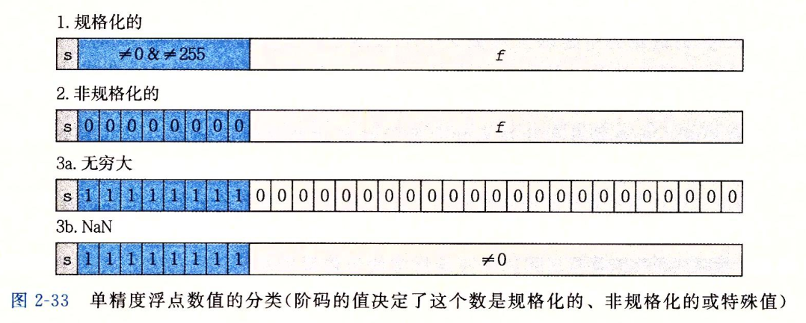
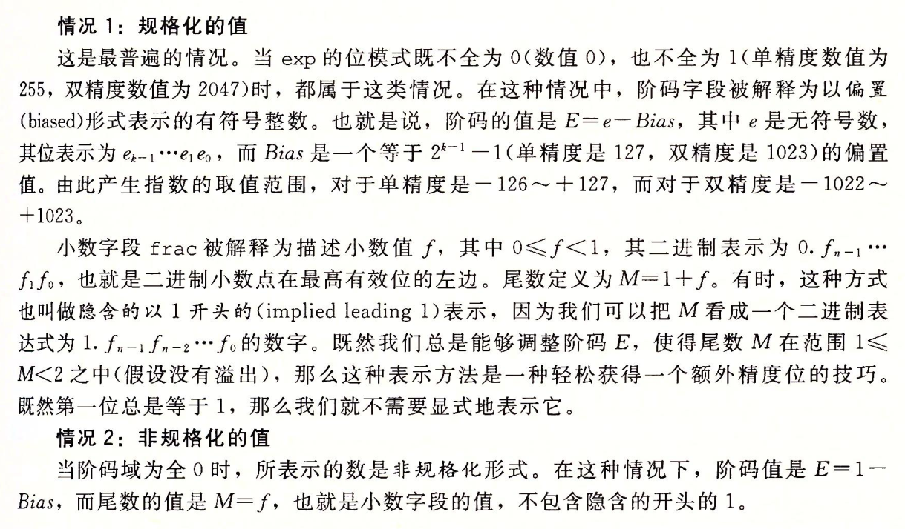
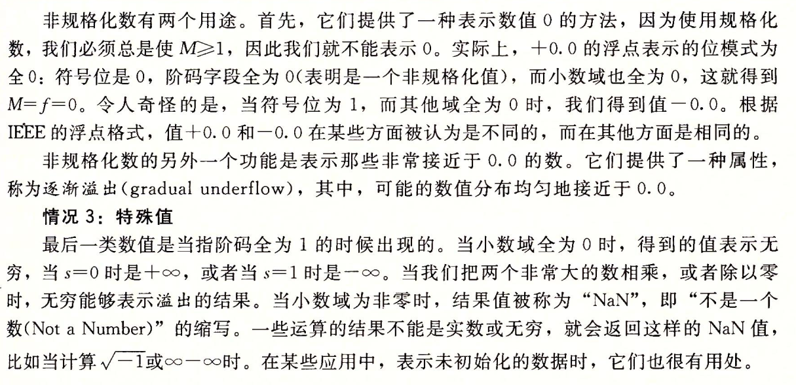
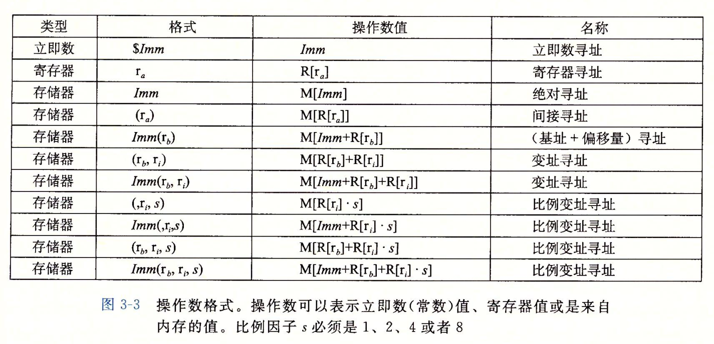

# CSAPP 课堂笔记 + 学习笔记

## Chapter 02

## Chapter 03

[位移运算符](https://port70.net/~nsz/c/c11/n1570.html#6.5.7)   
[数字运算-类型提升-考试要考](https://port70.net/~nsz/c/c11/n1570.html#6.3.1.8)   
[conversion](https://en.cppreference.com/w/c/language/conversion)   
[整形转换](https://port70.net/~nsz/c/c11/n1570.html#6.3.1.3)   
[Overflow](https://en.cppreference.com/w/c/language/operator_arithmetic#Overflows)   
[GCC 实现定义行为](https://gcc.gnu.org/onlinedocs/gcc/Integers-implementation.html#Integers-implementation)    

IEEE 754

- f32: 1-8-23
- f64: 1-11-52

   
    
   

## Machine Level Representation

