# 计算机网络学习笔记

&nbsp;   
### 参考书籍：

- [TCP/IP详解 卷1：协议]()
- [UNIX网络编程 卷1：套接字联网API]()
- [计算机网络 自顶向下方法（英文第6版）]()
- [Effective TCP/IP Programming（TCPIP高效编程：改善网络程序的44个技巧）]()

### 视频资料：

- [CS144 Introduction to Computer Networking Fall 2016 Stanford University](https://www.youtube.com/playlist?list=PLvFG2xYBrYAQCyz4Wx3NPoYJOFjvU7g2Z)
- [Computer Networking: A Top-Down Approach Sixth Edition](https://wps.pearsoned.com/ecs_kurose_compnetw_6/216/55463/14198700.cw/index.html)
- [计算机网络 - 哈尔滨工业大学](http://www.icourse163.org/course/HIT-154005)
- [IT Support: Networking Essentials - Microsoft: CLD260x](https://courses.edx.org/courses/course-v1:Microsoft+CLD260x+3T2018/course/)

### 笔记资料：

- [Computer Network Tutorials - GeeksforGeeks](https://www.geeksforgeeks.org/computer-network-tutorials/)
- [Data Communication & Computer Network - tutorialspoint](https://www.tutorialspoint.com/data_communication_computer_network/)
- [note/计算机网络/计算机网络.md](https://github.com/arkingc/note/blob/master/%E8%AE%A1%E7%AE%97%E6%9C%BA%E7%BD%91%E7%BB%9C/%E8%AE%A1%E7%AE%97%E6%9C%BA%E7%BD%91%E7%BB%9C.md)
- [CS-Notes/notes/计算机网络.md](https://github.com/CyC2018/CS-Notes/blob/master/notes/%E8%AE%A1%E7%AE%97%E6%9C%BA%E7%BD%91%E7%BB%9C.md)
- [InterviewMap - Network](https://yuchengkai.cn/docs/cs/)
- [Skill-Tree/计算机网络.md](https://github.com/linw7/Skill-Tree/blob/master/%E8%AE%A1%E7%AE%97%E6%9C%BA%E7%BD%91%E7%BB%9C.md)
- [Skill-Tree/网络编程.md](https://github.com/linw7/Skill-Tree/blob/master/%E7%BD%91%E7%BB%9C%E7%BC%96%E7%A8%8B.md)
- [笔试面试知识整理 - 计算机网络](https://hit-alibaba.github.io/interview/basic/network/)
- [搞定计算机网络面试，看这篇就够了 - 掘金](https://juejin.im/post/5b5f20686fb9a04f844adbdd)

### 实验资料：

- [Beej's Guide to Network Programming - Using Internet Sockets](https://beej.us/guide/bgnet/html/single/bgnet.html)
- [《计算机网络：自顶向下方法》配套实验：TCP模拟器 - 知乎](https://zhuanlan.zhihu.com/p/35390933)
- [Socket 编程实战](https://liujiacai.net/blog/2016/10/31/socket-programming/)

&nbsp;   
## 目录

- [CS144 学习笔记](#cs144)
  - 
  - 
  - 
- [计算机网络 - 哈尔滨工业大学 学习笔记](#computer_network_hit)
  - 
  - 
  - 
- 
  - 
- 
  - 

&nbsp;   
&nbsp;   

## CS144 学习笔记

### 1-1. A day in the life of an application
**Bidirectional, reliable byte stream** communication model  
Abstract away entire network -- just a pipe between 2 programs  
Application Level:

- WWW (HTTP)
- Skype
- BitTorrent

### 1-2. The four layer Internet model

Early 4 layer internet model:

- **Application**: Bi-directional reliable byte stream between 2 applications, using application-specific semantics(e.g. HTTP, BitTorrent)
- **Transport**: Guarantees correct, in-order delivery of data end-to-end. Controls congestion.
- **Network**: Delivers datagrams end-to-end. Best-effort delivery - no guarantees. Must use the Internet Protocol(IP)
- **Link**: Delivers data over a single link between an end host and router, or between routers.

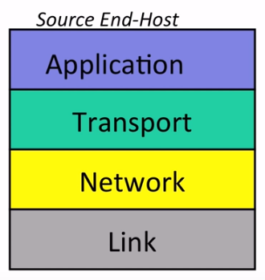

**IP**:

- IP makes a best-effort attempt to deliver our datagrams to the other end. But it makes no promises.
- IP datagrams can get lost, can be delivered out of order, and can be corrupted. There are no guarantees.

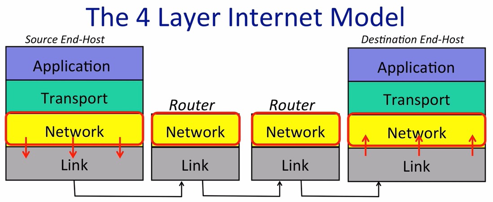

### 1-3. The IP service model

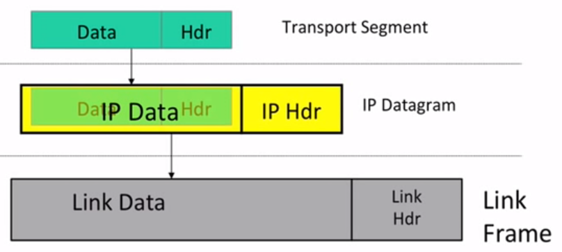

**Datagram**: Individually routed packets. Hop-by-hop routing.

- The IP service model provides a service which includes the routing to the destination.   
- The forwarding decision at each router is based on the **IP DA**( destination address).   
- Each router contains a **forwarding table** tells **where to send the packet next** after matching a given destination address. **The router doesnot know the whole path**.   
- Neither the sender nor the receiver know the whole path.

**Unreliable**: Packets might be dropped.

- dropped
- duplicated
- wrong destination

**Best effort**: but onlt if necessary.

**Connectionless**: No per-flow state. Packets might be mis-sequenced.

The reason IP is **simple**:

- Simple, dumb, minimal: faster, more streamlined, lower cost to build and maintain.
- The end-to-end principle: where possible, implement features in the end hosts.
- Allows a variety of reliable (or unreliable) services to be built on top.
- Works over any link layer: IP makes very few assumptions about the link layer below.

**The IP service model**   
1. Tries to prevent packets looping forever. (Because forwarding table might change. IP simply adds a **hop-count** (TTL) field in the header of each datagram)   
2. Will fragment packets if they are too long.   
3. Uses a header checksum to reduce chances of delivering datagram to wrong destination.   
4. Allows for new versions of IP: IPV4 and IPV6   
5. Allows for new options (fields) to be added to header.   

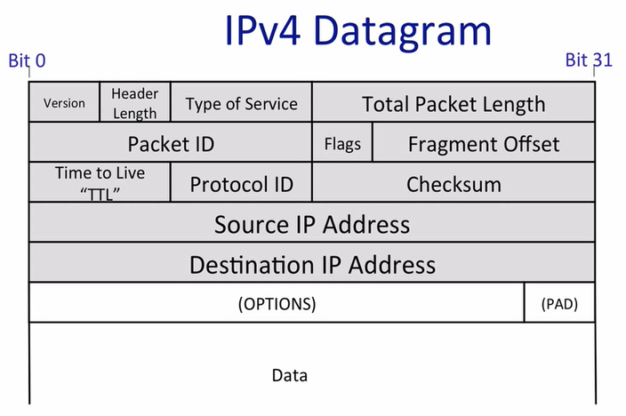

- **版本** : 有 4（IPv4）和 6（IPv6）两个值；
- **首部长度** : 占 4 位，因此最大值为 15。值为 1 表示的是 1 个 32 位字的长度，也就是 4 字节。因为首部固定长度为 20 字节，因此该值最小为 5。如果可选字段的长度不是 4 字节的整数倍，就用尾部的填充部分来填充。
- **区分服务** : 用来获得更好的服务，一般情况下不使用。
- **总长度** : 包括首部长度和数据部分长度。
- **生存时间** ：TTL，它的存在是为了防止无法交付的数据报在互联网中不断兜圈子。以路由器跳数为单位，当 TTL 为 0 时就丢弃数据报。
- **协议** ：指出携带的数据应该上交给哪个协议进行处理，例如 ICMP、TCP、UDP 等。
- **首部检验和** ：因为数据报每经过一个路由器，都要重新计算检验和，因此检验和不包含数据部分可以减少计算的工作量。
- **标识** : 在数据报长度过长从而发生分片的情况下，相同数据报的不同分片具有相同的标识符。
- **片偏移** : 和标识符一起，用于发生分片的情况。片偏移的单位为 8 字节。

### 1-4. A Day in the Life of a Packet

TCP 3 handshake

- [SYN] &nbsp;&nbsp;&nbsp; =>
- &emsp;&emsp;&emsp;&nbsp;&nbsp; <= &nbsp;&nbsp;&nbsp; [SYN, ACK]
- [ACK] &nbsp;&nbsp;&nbsp; =>

### 1-5. Packet switching principle

**Packet**: A self-contained unit of data that carries information necessary for it to reach its destination.

**Packet switching**: Independently for each arriving packet, pick its outgoing link. If the link is free, send it. Else hold the packet for later.

**Self-routing** is usually **turned off** because of the **security issues**: people owning routers donot want you telling them how to send packets. (trick to send packets to secret computer)

2 properties of packet switching:

- Simple packet forwarding
- Efficient sharing of links

#### No per-flow state required
**Flow**: A collection of datagrams belonging to the same end-to-end communication, e.g. a TCP connection.

- No per-flow state to be added/removed
- No per-flow state to be stored
- No per-flow state to be changed upon failure

Summary

- **Packet switches are simple**: they forward packets independently, and don't need to know about flows.
- **Packet switching is efficient**: it lets us efficiently share the capacity among many flows sharing the link.

### 1-6. Layering principle

Layers communicate sequentially with the layers above and below.

This separation of concerns allows each layer in the hierarchy to focus on doing its job well, and provide a well-defined service to the layer above.

The lower layers abstract away the details for higher layers.

Reasons for layering:

- Modularity
- Well defined service
- Reuse
- Separation of concerns
- Continuous improvement

### 1-7. Encapslation principle

### 1-8. Byte order

- Little Endian
- Big Endian

### 1-9a. IPv4 addresses

netmask，前面全是1。   
如果属于同一个网络，可以直接发送 packet；否则需要 router。

### 1-10a. Longest prefix match (LPM)

router 对 address 做 最长前缀匹配（根据自己的表），来决定下一个发往哪里。

### 1-11. Address Resolution Protocol (ARP)

ARP: I have a packet whose next hop is this address -- what **link address** should I send it to?

- **IP address**: a network-level address (describing **a host**, a unique destination) (a host can have multiple IP addresses)
- **link address**: describes a particular **network card**, **a unique device**

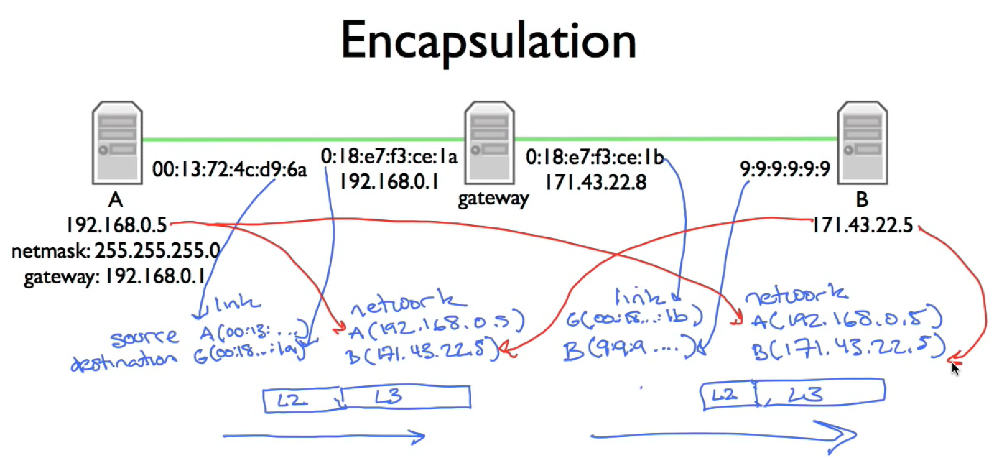

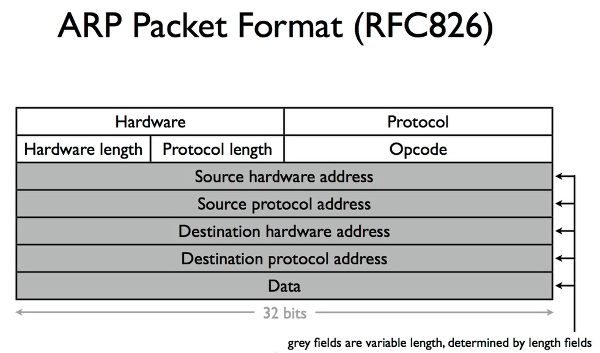

### 1-12. The Internet and IP Recap

### 2-0. Transport (intro)

### 2-1. TCP service model

#### Open connection

- [SYN] &nbsp;&nbsp;&nbsp; =>
- &emsp;&emsp;&emsp;&nbsp;&nbsp; <= &nbsp;&nbsp;&nbsp; [SYN, ACK]
- [ACK] &nbsp;&nbsp;&nbsp; =>

#### Close connection

- [FIN] &emsp;&nbsp; =>
- &emsp;&emsp;&emsp;&nbsp;&nbsp; <= &nbsp;&nbsp;&nbsp; [(Data +) ACK]
- &emsp;&emsp;&emsp;&nbsp;&nbsp; <= &nbsp;&nbsp;&nbsp; [FIN]
- [ACK] &nbsp;&nbsp;&nbsp; =>

#### The TCP Service Model

- Stream of Bytes
- Reliable delivery：
  - [ACK] indicates correct delivery
  - Checksum detects corrupted data
  - Sequence detects missing data
  - Flow-control prevents overrunning receiver
- In-sequence
- Congestion control

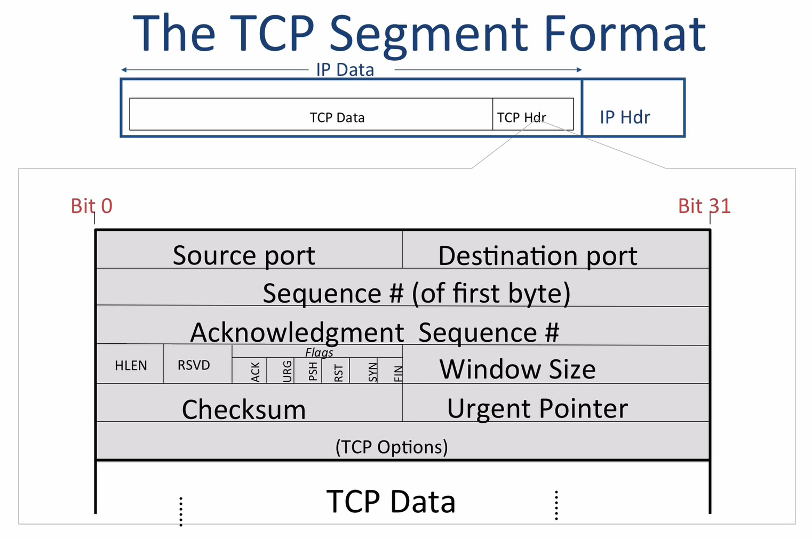

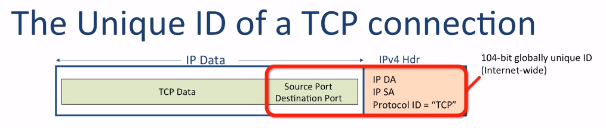
A TCP connection is uniquely identified by:

- IP Header:
  - IP Source address (IP SA)
  - IP Destination address (IP DA)
  - IP protocol ID
- TCP Source Port
- TCP Destination Port

[TCP connection walkthrough - YouTube](https://www.youtube.com/watch?v=F27PLin3TV0)

### 2-2. UDP service model

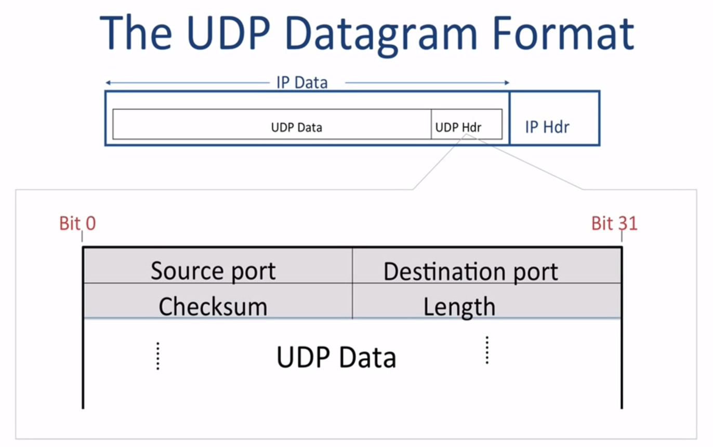

UDP has only **4 fileds** in the header:

- Source Port (16 bits)
- Destination Port (16 bits)
- Length: the length of whole UDP datagram (*It is 16-bits field and minimum value is 8-byte, i.e. the size of UDP header itself.*)
- Checksum (optional in IPV4)

#### UDP 3 properties:

- **Connection Datagram Service**
- **Self contained datagrams**: not in order
- **Unreliable delivery**
  - No Acknowlegments
  - No mechanism to detect missing or mis-sequenced datagrams
  - No flow control

#### UDP features:

- UDP is used when acknowledgement of data does not hold any significance
- UDP is good protocol for data flowing in one direction
- UDP is simple and suitable for query based communications
- UDP is not connection oriented
- UDP does not provide congestion control mechanism
- UDP does not guarantee ordered delivery of data
- UDP is stateless
- UDP is suitable protocol for streaming applications such as VoIP, multimedia streaming

#### UDP application:

- Domain Name Services （幂等，可重发请求）
- Simple Network Management Protocol
- Trivial File Transfer Protocol
- Routing Information Protocol
- Kerberos

> 最后说：现在 video stream of http 使用 TCP 而不是 UDP   
> 参考：   
> [TCP vs UDP on video stream](https://stackoverflow.com/questions/6187456/tcp-vs-udp-on-video-stream)   
> [Does YouTube stream Videos via TCP?](https://stackoverflow.com/questions/19620219/does-youtube-stream-videos-via-tcp)   
> [Does HTTP use UDP?](https://stackoverflow.com/questions/323351/does-http-use-udp)   
> [RTP - Real-time Transport Protocol](https://en.wikipedia.org/wiki/Real-time_Transport_Protocol) （基于UDP，RTP没有 *确认* 和 *请求重传*）   
> [QUIC - Quick UDP Internet Connection](https://en.wikipedia.org/wiki/QUIC)

### 2-3. ICMP service model

#### ICMP - Internet Control Message Protocol

- communicates Network layer information between end hosts and routers
- **reports error conditions**
- diagnoses problems

#### ICMP 2 properties:

- Reporting Message: self-contained message reporting error
- Unreliable: no retries

example: "ping", "traceroute"

> Traceroute：允许用户跟踪从一台主机到世界上任意一台其他主机之间的路由，使用ICMP报文实现。发送一系列不可达UDP端口号的UDP报文段，每个报文段封装后的数据报TTL字段逐1递增，TTL为n的数据报到达第n跳路由器时，由于TTL过期，路由器会生成ICMP报文响应，由此可以获得第n跳路由器的IP和名字，当一个数据报最终到达目的主机时，由于UDP端口不可达，目的主机生成一个ICMP报文，指示此错误信息，从而Traceroute知道不需要再发送探测分组了，因此获得了到达目的主机的所有路由数量、标识以及RTT

### 2-4. End to End Principle

Reliability

### 2-5. Error detection

- Checksum
- CRC (Cyclic redundancy code)
- MAC (Message authentication code)

#### Checksum (IP, TCP)

- sum all of the word
- two's complement

#### [CRC](https://en.wikipedia.org/wiki/Cyclic_redundancy_check) (link layer)

模2的多项式环   

#### [MAC](https://en.wikipedia.org/wiki/Message_authentication_code) ([TLS](https://en.wikipedia.org/wiki/Transport_Layer_Security))

发送方签名，接收方认证（**双方持有一个相同的key**）

注意这几种检错码的功能比较：yes，no   
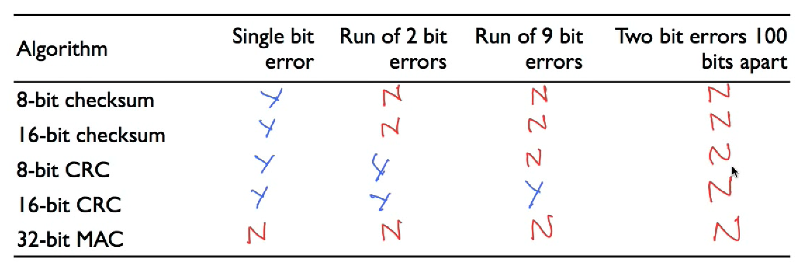

### 2-6. Finite state machines 1

TCP 3 handshake

### v12. Stop and wait

Flor Control

- Don't send more packets than receiver can process
- Receiver gives sender feedback
- 2 basic approaches
  - **Stop and wait**
  - **Sliding window**

#### Stop and wait

- At most **1** packet in flight at any time
- Sender sends **1** packet
- Receiver sends acknowlegment packets when it receives data
- On receiving acknowlegment, sender sends new data
- On timeout, sender resends current data
- Detect duplicates

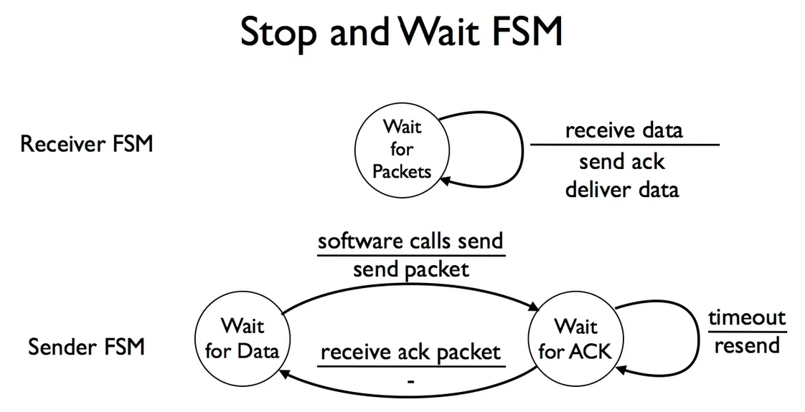

### [v22. Sliding window](https://www.youtube.com/watch?v=Atg0HxQdafo&list=PLvFG2xYBrYAQCyz4Wx3NPoYJOFjvU7g2Z&index=22)

- Generalization of stop-and-wait: allow multiple un-acked segments
- Bound on number of un-acked segments, called *window*
- Can keep pipe full

发送方不能发送超过 last-ack + window-size（RWS） 的 packet   
接收方发送 ack 为 the end(+1) of contiguous data received（TCP ack field refers to next expected data）

- 接收方窗口（RWS） 小于 发送方窗口（SWS）
- 回退N协议：接收方窗口为1
- 需要的 sequence number 为 （RWS + SWS）

### [v23. Reliable communication - Retransmission strategies](https://www.youtube.com/watch?v=KMbWM4yfSzs&index=23&list=PLvFG2xYBrYAQCyz4Wx3NPoYJOFjvU7g2Z)

- Go back N (pessimistic)
- **Selective repeat (optimistic)：假设接收方只有 ACK-m 之后的那一个没有收到，其余全部收到（如果接收方缓存足够）。重新发送 m+1，但 m+1 之后的并不重新发送。**

结论：

- 如果接收方窗口很小，使用 Go back N (pessimistic)
- 如果接收方窗口足够（接近发送方），使用 Selective repeat (optimistic)

### [v24. Reliable communication - TCP header](https://www.youtube.com/watch?v=Qqx2xpTFbEM&list=PLvFG2xYBrYAQCyz4Wx3NPoYJOFjvU7g2Z&index=24)

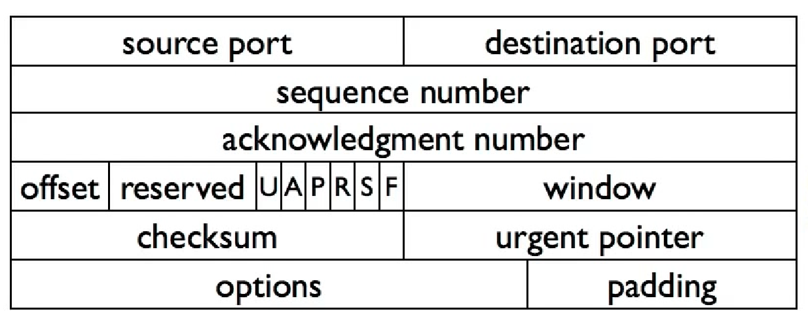

TCP头长度固定 20B

- Sequence Number (32-bits)：Sequence number of data bytes of a segment in a session
- Ack number (32-bits)：接收到的最后一个字节的**下一个**，即下一个期待的字节

### v25. Reliable communication - Connection setup and teardown

### 2-12. Transport (recap)

&nbsp;   
&nbsp;   

## 计算机网络 - 哈尔滨工业大学 学习笔记

