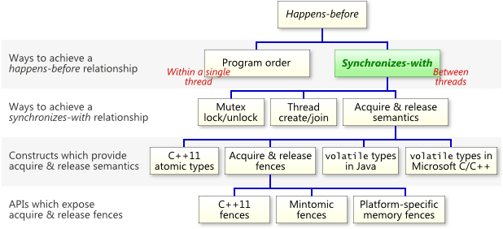

# C++ Concurrency In Action

- [Hello, world of concurrency in C++!](#1)
- [Managing threads](#2)
- [Sharing data between threads](#3)
- [Synchronizing concurrent operations](#4)
- [The C++ memory model and operations on atomic types](#5)
- [](#6)
- [](#7)
- [](#8)
- [](#9)


&nbsp;   
### 其他参考资料

> 本书的中文翻译坑的一笔（看上去绝对不是机翻，神坑）；   
> 参考标准委员会的文章和邮件；   
> 总之要多看一些文章和帖子；   
> 笔记中掺杂了一些我个人的理解；   

- [本书勘误表](https://www.cplusplusconcurrencyinaction.com/errata.html)
- [[14882 § 6.8.2] - Multi-threaded executions and data races](http://eel.is/c++draft/intro.multithread)
- [线程支持库 - zh/cppreference](https://zh.cppreference.com/w/cpp/thread)
- [原子操作库 - zh/cppreference](https://zh.cppreference.com/w/cpp/atomic)
- [C++11 Multithread Tutorial Series](https://thispointer.com/c11-multithreading-tutorial-series/)
- [A Detailed Cplusplus Concurrency Tutorial 《C++ 并发编程指南》](https://github.com/forhappy/Cplusplus-Concurrency-In-Practice)
- [C++11 并发指南系列](https://www.cnblogs.com/haippy/p/3284540.html)
- [Operating Systems: Three Easy Pieces](http://pages.cs.wisc.edu/~remzi/OSTEP/#book-chapters)


&nbsp;   
<a id="1"></a>
## Ch01 Hello, world of concurrency in C++!

C++ 标准并未对 **进程间通信** 提供任何支持，本书只关注多线程的并发。

为什么需要并发？

- 分离不同的功能（在同一时刻会有多种功能）（**对线程的划分是基于概念上的设计，而不是为了增加吞吐量的尝试**）
- 性能
  - 单任务并行：将一个任务切割成多块
      - 算法并行：算法分块执行
      - 数据并行：同样的操作，处理不同数据
  - 使用可并行的方式，处理更多


&nbsp;   
<a id="2"></a>
## Ch02 Managing threads

使用 `std::thread` 要注意

- most vexing parsing
- 在 `thread` 析构之前调用 `.join()` 或 `.detach()`
  - [`detach()`](https://zh.cppreference.com/w/cpp/thread/thread/detach) 可以立即调用
  - [`join()`](https://zh.cppreference.com/w/cpp/thread/thread/join) 需要选择适当的位置，注意**如果在 `join()` 调用之前线程抛出异常**
- 可移动，不可复制
- `thread& operator=( thread&& other ) noexcept`若 `*this` 仍拥有关联的运行中进程（即 `joinable() == true` ），则调用 `std::terminate() `。否则，赋值 `other` 的状态给 `*this` 并设置 `other` 为默认构造的状态。
此调用后，`this->get_id()` 等于 `other.get_id()` 在调用前的值，而 `other` 不再表示执行的线程
- [`static unsigned int std::thread::hardware_concurrency() noexcept;`](https://zh.cppreference.com/w/cpp/thread/thread/hardware_concurrency)：返回实现所支持的并发线程数。应该只把值当做提示
- class [`std::thread::id`](https://zh.cppreference.com/w/cpp/thread/thread/id)：std::thread 的标识符；**一旦线程结束，则 std::thread::id 的值可为另一线程复用**；`std::thread::id` is **comparable** and **hashable**
  - 若两个 id 相等 (`.operator==`)，则
      - 若都持有线程，则 same
      - 否则不确定
- `namespace std::thread::this_thread`
  - [`yield()`](https://zh.cppreference.com/w/cpp/thread/yield)
  - [`get_id()`](https://zh.cppreference.com/w/cpp/thread/get_id)：通常用来判断某些线程是否要做一些特殊操作
  - [`sleep_for()`](https://zh.cppreference.com/w/cpp/thread/sleep_for)
  - [`sleep_until()`](https://zh.cppreference.com/w/cpp/thread/sleep_until)
- 了解一下 [`std::chrono`](https://zh.cppreference.com/w/cpp/chrono)


&nbsp;   
其他：

- 一份关于 [2_4_parallel_accumulate.cpp](https://github.com/rsy56640/daily_learning/blob/master/Cpp_learning/Cpp_Concurrency_In_Action/code/2_4_parallel_accumulate.cpp) 的代码的一些说明：要求结合律，要求默认构造函数，浮点类型求和可能被系统截断。另外，注意到在lambda表达式中 `std::ref()` 和 `std::mem_fn()` 的使用（其实写成lambda就没有必要了）。


&nbsp;   
<a id="3"></a>
## Ch03 Sharing data between threads

- [**race conditions**](https://zh.cppreference.com/w/cpp/language/memory_model#.E7.BA.BF.E7.A8.8B.E4.B8.8E.E6.95.B0.E6.8D.AE.E7.AB.9E.E4.BA.89)
- 设计 **数据结构** 和 **invariant**（即约定好数据结构的性质）
- 事务性支持？？？
- **互斥量**（[**`std::mutex`**](https://zh.cppreference.com/w/cpp/thread/mutex)，使用 [`std::lock_guard`](https://zh.cppreference.com/w/cpp/thread/lock_guard) with RAII 机制）（注：互斥的 **所有权** 即上锁；互斥的 **关联** 则是记录这个锁的索引）
  - 通常 mutex 和 critical data 作为 private member
  - 谨慎设计接口，尤其是函数将 critical data 的 handle 传递到外部
  - 讲了一个 `stakc<vector<int>>` sample，但其实有 guaranteed copy elision。如果连内存都分配失败，那还不如重启
  - 接口：
      - [`std::mutex::lock()`](https://zh.cppreference.com/w/cpp/thread/mutex/lock)（若持有 mutex 的线程调用，则 UB）
      - [`std::mutex::try_lock()`](https://zh.cppreference.com/w/cpp/thread/mutex/try_lock)：不阻塞，立即返回成功或失败（若持有 mutex 的线程调用，则 UB）
      - [`std::mutex::unlock()`](https://zh.cppreference.com/w/cpp/thread/mutex/unlock)（若当前线程不持有 mutex，则 UB）
      - [`std::mutex::~mutex()`](https://zh.cppreference.com/w/cpp/thread/mutex/~mutex)（若 mutex 为任何线程占有，或若任何线程在保有 mutex 的所有权时终止，则 UB）
  - [`std::timed_mutex`](https://zh.cppreference.com/w/cpp/thread/timed_mutex)：定时 mutex，支持 [`std::timed_mutex::try_lock_for()`](https://zh.cppreference.com/w/cpp/thread/timed_mutex/try_lock_for)；代码样例：[std_timed_mutex.cpp](https://github.com/rsy56640/daily_learning/blob/master/Cpp_learning/Cpp_Concurrency_In_Action/code/std_timed_mutex.cpp)
  - [`std::recursive_mutex`](https://zh.cppreference.com/w/cpp/thread/recursive_mutex)：支持同一线程内多次 lock
  - [`std::recursive_timed_mutex`](https://zh.cppreference.com/w/cpp/thread/recursive_timed_mutex)
  - 注意 traits：[BasicLockable](https://zh.cppreference.com/w/cpp/named_req/BasicLockable), [Lockable](https://zh.cppreference.com/w/cpp/named_req/Lockable), [TimedLockable](https://zh.cppreference.com/w/cpp/named_req/TimedLockable)
- [`class std::lock_guard`](https://zh.cppreference.com/w/cpp/thread/lock_guard)：RAII 互斥锁定（允许构造前已经锁定，即 `std::adopt_lock`）（不支持 move）
- [`class std::unique_lock`](https://zh.cppreference.com/w/cpp/thread/unique_lock)：RAII 互斥锁定，但提供了更好的上锁和解锁控制（注意[*构造函数*](https://zh.cppreference.com/w/cpp/thread/unique_lock/unique_lock) 和 [*析构函数*](https://zh.cppreference.com/w/cpp/thread/unique_lock/~unique_lock)，并且可以在 scope 内不断调用 `unlock()` 和 `lock()`）（`std::unique_lock` 比 `std::lock_guard` 灵活，但是占用更大的空间，并且性能稍微差一点）（支持 move ctor 和 move assign）
- **3个tag**：
  - [`std::defer_lock`](https://zh.cppreference.com/w/cpp/thread/lock_tag)：不获得互斥的所有权（只是关联，之后调用 `lock()`）
  - [`std::try_to_lock`](https://zh.cppreference.com/w/cpp/thread/lock_tag)：尝试获得互斥的所有权而不阻塞（之后调用 `bool owns_lock() const noexcept;` 检查）
  - [`std::adopt_lock`](https://zh.cppreference.com/w/cpp/thread/lock_tag)：假设调用方线程已拥有互斥的所有权（*没明白有什么用，相当于只提供了析构，那为什么上锁的时候不构造 `lock_guard` 或 `unique_lock`*；好像是因为有时候上锁只操作 mutex，所以之后 **再补一个自动析构**）
- **DeadLock**
  - [`std::lock()`](https://zh.cppreference.com/w/cpp/thread/lock), [`class std::scoped_lock;`](https://zh.cppreference.com/w/cpp/thread/scoped_lock)：死锁避免；要么全锁，要么全不锁（抛异常）
  - `std::lock()` 要保证自动析构：
      - 之前 `std::unique_lock(mutex, std::defer_lock);`
      - 之后 `std::unique_lock(mutex, std::adopt_lock);` 或者 `std::lock_guard(mutex std::adopt_lock);`（推荐）
      - `std::unique_lock` 析构时会检查 mutex 的所有权来决定是否 unlock
      - `std::lock_guard` 析构时会直接 unlock
- 死锁避免：
  - 避免嵌套锁：最好一个线程只持有一个锁
  - 当需要多个锁时：使用 `std::lock()` 或 `class scoped_lock;`提供了免死锁算法；或者自己设计锁分配算法
  - （尽量）避免在持有锁时调用用户代码。（有时必须要给用户上锁）
  - （priority）使用固定顺序获得多个锁
  - 使用锁的层次结构：运行时记录并检查
- **锁的粒度**：一般情况下，执行必要的操作时，尽可能将持有锁的时间缩减到最小。
  - 当采用细粒度的锁时，注意语义的变化。（对一些值的操作有可能发生在不同时刻）
- [静态局部变量的初始化](https://zh.cppreference.com/w/cpp/language/storage_duration#.E9.9D.99.E6.80.81.E5.B1.80.E9.83.A8.E5.8F.98.E9.87.8F)：标准保证了静态局部变量被准确初始化一次
- Double-Checked Locking pattern：race condition（见下）
- [`class std::once_flag`](https://zh.cppreference.com/w/cpp/thread/once_flag)
- [**`std::call_once()`**](https://zh.cppreference.com/w/cpp/thread/call_once)：**准确执行一次**可调用 (Callable) 对象 f，即使同时从多个线程调用（若抛异常，则传播；并且不消耗 `std::once_flag`）（用途：打开 socket connection；打开文件；等准确初始化一次资源）
- **读写锁**：保护*很少更新*的数据结构
  - [**`class std::shared_mutex`**](https://zh.cppreference.com/w/cpp/thread/shared_mutex)：通常用于多个读线程能同时访问同一资源而不导致数据竞争，但只有一个写线程能访问的情形
  - [`class std::shared_lock`](https://zh.cppreference.com/w/cpp/thread/shared_lock)：共享模式锁定关联的互斥
  - 读上锁：`std::shared_lock slk{smtx};` *可共享互斥*
  - 写上锁：`std::lock_guard lg{smtx};` *排他互斥*
- 嵌套锁：有时成员函数会调用其他成员函数，导致多次上锁
  - [`class std::recursive_mutex`](https://zh.cppreference.com/w/cpp/thread/recursive_mutex)：不推荐使用。（注意维护 *数据结构* 和 *invariant* 的逻辑；提取出一些操作作为私有函数，并不上锁）


&nbsp;   
其他：

> 原子性：**缓存锁**，**总线锁**   
> [聊聊并发（五）原子操作的实现原理](http://ifeve.com/atomic-operation/)

获取 `std::thread::id` 标识的 int   
```c++
inline int get_id(const std::thread::id tid)
{
	std::ostringstream os;
	os << tid;
	return std::stoi(os.str());
}
```

&nbsp;   
声名狼藉的 Double-Checked Locking pattern：   
1 和 3 引发 race condition
```c++
struct some_resource { void do_something() {} };
std::shared_ptr<some_resource> resource_ptr;
std::mutex resource_mutex;
void undefined_behaviour_with_double_checked_locking()
{
	if (!resource_ptr)                               // 1
	{
		std::lock_guard<std::mutex> lk(resource_mutex);
		if (!resource_ptr)                           // 2
		{
			resource_ptr.reset(new some_resource);   // 3
		}
	}
	resource_ptr->do_something();                    // 4
}
```

读写锁 [std_shared_mutex.cpp](https://github.com/rsy56640/daily_learning/blob/master/Cpp_learning/Cpp_Concurrency_In_Action/code/std_shared_mutex.cpp)：使用 `std::shared_mutex`

- 读上锁：`std::shared_lock slk{smtx};` *可共享互斥*
- 写上锁：`std::lock_guard lg{smtx};` *排他互斥*


&nbsp;   
Ref:

- [Is std::lock() ill-defined, unimplementable, or useless?](https://stackoverflow.com/questions/18520983/is-stdlock-ill-defined-unimplementable-or-useless)
- [Massive CPU load using std::lock (c++11)](https://stackoverflow.com/questions/13667810/massive-cpu-load-using-stdlock-c11)
- [如何理解互斥锁、条件锁、读写锁以及自旋锁？](https://www.zhihu.com/question/66733477)


&nbsp;   
<a id="4"></a>
## Ch04 Synchronizing concurrent operations

- 等待时间或条件：
  - (1) shared falg (使用mutex)
      - 等待线程 keeps checking；执行线程 do task，然后写 flag
      - 2个缺点：
          - 1) check flag 上锁，消耗时间
          - 2) 等待线程可能消耗其他资源
      - 改进：等待线程 `std::this_thread::sleep_for();`（但是很难确定休眠时间）
  - (2) 使用条件变量去触发事件并唤醒
     - 虚假唤醒
     - unlock 与 signal 顺序
     - 需要几个条件变量
     - 唤醒特定的线程
- 使用 `std::future` 来等待**一次性事件（one-off event）**
  - [std::future](https://zh.cppreference.com/w/cpp/thread/future) ：提供访问异步操作结果的机制。可移动，不可复制
      - `T/T&/void get();`
      - `void wait();`
      - `bool valid() const noexcept;`
      - `std::shared_future<T> share() noexcept;`
      - `enum class` [`std::future_status`](https://zh.cppreference.com/w/cpp/thread/future_status)
          - `ready`：共享状态就绪
          - `timeout`：共享状态在经过指定的时限时长前仍未就绪
          - `deferred`：共享状态含有延迟的函数，故将仅在显式请求时计算结果
  - [std::promise](https://zh.cppreference.com/w/cpp/thread/promise)：每个 promise 与共享状态关联，共享状态含有一些状态信息和可能仍未求值的结果，它求值为值（可能为 void ）或求值为异常。 promise 可以对共享状态做三件事：（如有疑惑，参考 [promise - 搜索 shared state](http://eel.is/c++draft/futures.promise) 和 [共享状态](http://eel.is/c++draft/futures.state)）
      - **使就绪**：promise 存储结果或异常于共享状态。标记共享状态为就绪，并解除阻塞任何等待于与该共享状态关联的 future 上的线程
      - **释放**：promise 放弃其对共享状态的引用。若这是最后一个这种引用，则销毁共享状态。除非这是 `std::async` 所创建的未就绪的共享状态，否则此操作不阻塞
      - **抛弃**：promise 存储以 `std::future_errc::broken_promise` 为 error_code 的 `std::future_error` 类型异常，令共享状态为就绪，然后释放它
      - `~promise()`：若共享状态就绪，则释放它；若共享状态未就绪，则存储以 `std::future_errc::broken_promise` 为 error_condition 的 `std::future_error` 类型异常对象，令共享状态就绪再释放它
  - [std::packaged_task](https://zh.cppreference.com/w/cpp/thread/packaged_task)：包装任何可调用 (Callable) 目标，使得能异步调用它（通常用于线程间传递任务）
      - 通过 `get_future()` 得到 `std::future<R>`
      - `void operator()(Args... args);`：以 args 为参数调用存储的任务。任务返回值或任何抛出的异常被存储于共享状态。令共享状态就绪，并解除阻塞任何等待此操作的线程；（`void make_ready_at_thread_exit(Args... args);` 仅在当前线程退出，并销毁所有线程局域存储期对象后，才令共享状态就绪。）
      - 由于 `packaged_task` 是可调用的，可以新建 `std::thread(std::move(task), args...);`
  - [std::async](https://zh.cppreference.com/w/cpp/thread/async)（大概会根据硬件情况来调整以获得最佳性能）
      - `enum class` [`std::launch`](https://zh.cppreference.com/w/cpp/thread/launch)
          - `std::launch::async`：运行新线程，以异步执行任务
          - `std::launch::deferred`：调用方线程上首次请求其结果时执行任务（惰性求值）
  - [std::shared_future](https://zh.cppreference.com/w/cpp/thread/shared_future)：允许多个线程等候同一共享状态，`std::shared_future` 可复制，而且多个 `std::shared_future` 对象能指代同一共享状态。（若每个线程通过其自身的 shared_future 对象副本访问，则从多个线程访问同一共享状态是安全的。）
- [namespace std::chrono](https://zh.cppreference.com/w/cpp/header/chrono)
  - `std::chrono::system_clock`
  - `std::chrono::duration`
  - `std::chrono::time_point`
  - `std::literals::chrono_literals`
- Communicating Sequential Processer
- **Message Passing Interface**：没有共享数据，每个线程都是一个**状态机**，通过**消息队列**通信


&nbsp;   
>关于 Condition Variable，参考 [Condition Variables - Operating Systems: Three Easy Pieces](http://pages.cs.wisc.edu/~remzi/OSTEP/threads-cv.pdf)   
>**hold the lock when calling signal(mostly) or wait(always)**   
>[用条件变量实现事件等待器的正确与错误做法 - 陈硕的Blog](http://www.cppblog.com/Solstice/archive/2013/09/09/203094.html)   

&nbsp;   
关于虚假唤醒（[Spurious wakeup](https://en.wikipedia.org/wiki/Spurious_wakeup)）：等待线程有可能偶然返回（**因为接受signal，处理时有可能忽略了notification，所以从wait返回，注意退出wait时已经重新锁定lock**）

&nbsp;   
线程安全队列：[4_5_thread_safe_queue.cpp](https://github.com/rsy56640/daily_learning/blob/master/Cpp_learning/Cpp_Concurrency_In_Action/code/4_5_thread_safe_queue.cpp)（事实上，如何设计要根据具体场景trade-off）

&nbsp;   
当异常类型已知时，建议使用 `prom.set_exception(std::make_exception_ptr(...));` 而不是 `prom.set_exception(std::current_exception());`（这样编译器可以优化；不过异常对象的构造参数也许无法得知，这样就不一样了）

```c++
struct Ex { int i = 9; };
int foo_ex(int i) {
	if (i < 5) throw Ex{};
	return 233;
}
void test()
{
	std::promise<double> prom;
	try {
		prom.set_value(foo_ex(2));
	}
	catch (...) {
		// prom.set_exception(std::current_exception());
		prom.set_exception(std::make_exception_ptr(Ex{})); // better on performance but not the same exception
	}
}
```

&nbsp;   
[异步测试程序](https://github.com/rsy56640/daily_learning/blob/master/Cpp_learning/Cpp_Concurrency_In_Action/code/fucking_test_threads_pool_with_fucking_stdchrono.cpp)：比较了 单线程，线程池异步调度，`std::async`。


&nbsp;   

- [pthread_cond_signal RATIONALE](http://pubs.opengroup.org/onlinepubs/9699919799/functions/pthread_cond_signal.html#tag_16_418_08)
- [Why does pthread_cond_wait have spurious wakeups?](https://stackoverflow.com/questions/8594591/why-does-pthread-cond-wait-have-spurious-wakeups)
- [Spurious wakeups explanation sounds like a bug that just isn't worth fixing, is that right?](https://softwareengineering.stackexchange.com/questions/186842/spurious-wakeups-explanation-sounds-like-a-bug-that-just-isnt-worth-fixing-is)
- [Do spurious wakeups in Java actually happen?](https://stackoverflow.com/questions/1050592/do-spurious-wakeups-in-java-actually-happen/1051816#1051816)
- [basic question about concurrency - Google Forum](https://groups.google.com/forum/?hl=ky#!msg/comp.programming.threads/wEUgPq541v8/ZByyyS8acqMJ) 参考 Dave Butenhof 的回复（《Programming with POSIX threads》作者）
- [Real cause of spurius wakeups - Google Forum](https://groups.google.com/forum/#!msg/comp.programming.threads/h6vgL_6RAE0/Ur8sq72OoKwJ)
- [Spurious wakeups](http://blog.vladimirprus.com/2005/07/spurious-wakeups.html)
- [Calling pthread_cond_signal without locking mutex - Stack Overflow](https://stackoverflow.com/questions/4544234/calling-pthread-cond-signal-without-locking-mutex) 第一个答案评论区 R 是某版本pthread作者
- [The actor model in 10 minutes](https://www.brianstorti.com/the-actor-model/)
- [Hewitt, Meijer and Szyperski: The Actor Model (everything you wanted to know...) - YouTube](https://www.youtube.com/watch?v=7erJ1DV_Tlo)（这个好厉害）


&nbsp;   
<a id="5"></a>
## Ch05 The C++ memory model and operations on atomic types

[[14882 § 6.8.2] - Multi-threaded executions and data races](http://eel.is/c++draft/intro.multithread#intro.races-4)   
>&nbsp; 4. All modifications to a particular atomic object M occur in some particular total order, called the **modification order** of M. [ Note: There is a separate order for each atomic object. There is no requirement that these can be combined into a single total order for all objects. In general this will be impossible since different threads may observe modifications to different objects in inconsistent orders. — end note ]   
>&nbsp; 20. [ Note: The value observed by a load of an atomic depends on the “happens before” relation, which depends on the values observed by loads of atomics. The intended reading is that there must exist an association of atomic loads with modifications they observe that, together with suitably chosen modification orders and the “happens before” relation derived as described above, satisfy the resulting constraints as imposed here. — end note ]


对于一个 atomic 对象，它存在唯一一个 modification order，即该对象从诞生以来被修改的顺序。而 load 读到的值可以是从上次读取到最近修改中间任意一个(包括上次读取的值)。（注意到，即使有 happens-before关系，中间也可能插入另一个线程的写操作）。总之读到的值是 （该线程）**现在已经到达的点**（就这个意思，参考p131 number list例子）位于 modification order **及以后**的值。    
如果操作是 RMW，那么确保读到最新的值，即 modification order 最后的值。

---

- [内存模型](https://zh.cppreference.com/w/cpp/language/memory_model)
- [std::atomic_flag](https://zh.cppreference.com/w/cpp/atomic/atomic_flag)：免锁的原子布尔类型（可以理解为*是否被占用*）
  - 初始化：`std::atomic_flag lock = ATOMIC_FLAG_INIT;`
  - [`bool test_and_set(order)`]()：原子地设置标志为 true 并获得其先前值（返回false即表示成功占用，返回true则自旋等待）
  - [`void clear(order)`](https://zh.cppreference.com/w/cpp/atomic/atomic_flag/clear)：原子地设置标志为 false
  - 自旋锁：
```c++
while (lock.test_and_set(std::memory_order_acquire))  // acquire lock
    ; // spin
// ...
lock.clear(std::memory_order_release);                // release lock
```
- [std::atomic](https://zh.cppreference.com/w/cpp/atomic/atomic)
  - [`void store(T desired, order)`](https://zh.cppreference.com/w/cpp/atomic/atomic/store)：原子地以 `desired` 替换当前值，按照 `order` 的值影响内存
  - [`void operator=(T desired)`](https://zh.cppreference.com/w/cpp/atomic/atomic/operator%3D)：等价于 `store(desired)`
  - [`T load(order)`](https://zh.cppreference.com/w/cpp/atomic/atomic/load)：原子地加载并放回原子变量的当前值，按照 `order` 的值影响内存
  - [`T operator T()`](https://zh.cppreference.com/w/cpp/atomic/atomic/operator_T)：等价于 `load()`
  - [`T exchange(T desired, order)`]()：原子地以 `desired` 替换底层值，返回之前的值；操作为 *read-modify-write*；根据 `order` 的值影响内存
  - [`bool compare_exchange_weak(T& expected, T desired)`, `bool compare_exchange_strong(T& expected, T desired)`](http://eel.is/c++draft/atomics.types.operations#18)：原子地比较 `*this` 和 `expect` 的值表示。若相同，则把 `desired` 写入 `*this`；若不同，则将 `*this` 的值加载进 `expect`
  - `bool compare_exchange_weak()`的用法：思路是根据条件不断计算值，直到条件值相等（若不等，条件值会被更新为 `*this`）
      - compare-and-swap [[$30.7.1.20]](http://eel.is/c++draft/atomics.types.operations#20)
      - 链表添加（这个之后还会牵扯到ABA问题）：
```c++
// a simple global linked list:
struct Node { int value; Node* next; };
std::atomic<Node*> list_head(nullptr);

void append(int val)
{
	// append an element to the list
	Node* newNode = new Node{ val, list_head };

	// next is the same as: list_head = newNode, but in a thread-safe way:
	while (!list_head.compare_exchange_weak(newNode->next, newNode)) {}
	// (with newNode->next updated accordingly if some other thread just appended another node)
}
```
- 特化的 `std::fetch_xx`

### 内存模型 threads don’t have to agree on the order of events（非 seq_cst）
[std::memory_order](https://en.cppreference.com/w/cpp/atomic/memory_order)

- **sequenced-before**：（线程内）if one operation is sequenced before another, then it also happens-before it. 
- **synchronized-with**：（线程间）if operation A in one thread synchronizes-with operation B in another thread, then A inter-thread happens before B. 
- **happens-before**：transitive

#### *sequentially consistent*
`std::memory_order_seq_cst`：全局一致（a single global order of events）

#### *relaxed*
`std::memory_order_relaxed`：线程间无同步制约（其他*某一*线程 Load-Load，保证第二个 Load 不会读到之前的值，参考p131 ask a number in list 的例子）

#### *acquire-release*
Synchronization is **pairwise**, between the thread that does the *release* and the thread that does the *acquire*. *A release operation **synchronizes-with** an acquire operation that reads the value written*. Synchronization with acquire-release has the **transitive** nature of *happens-before*.

- `std::memory_order_acquire`，`std::memory_order_release`：形成 synchronized-with
- `std::memory_order_acq_rel`：A *read-modify-write* operation with this memory order is both an *acquire* operation and a *release* operation.

| thread 1 | thread 2 |
| ---------- | ---------- |
| *fence(release)* |      |
|   *store()*  |              |
|              |   *load()*   |
|      | *fence(acquire)* |

#### `std::memory_order_consume`：data dependency
- *dependency-ordered-before*：线程间 `store(rel/acq_rel/seq_cst)` -> `load(consume)`
- *carries-a-dependency-to*：线程内
- 若 `load(consume)` 的值 *carries-a-dependency-to* 操作A，那么 `store()` happens-before 操作A；对于线程内无 *carries-a-dependency-to* 关系的操作，没有 happens-before 关系
  - [std::kill_dependency](https://en.cppreference.com/w/cpp/atomic/kill_dependency)

#### Release sequences and synchronizes-with
没看懂？？？

[6.8.2.1.5](http://eel.is/c++draft/intro.multithread#intro.races-5)   
> A release sequence headed by a release operation A on an atomic object M is a maximal contiguous sub-sequence of side effects in the modification order of M, where the first operation is A, and every subsequent operation is an atomic read-modify-write operation.

&nbsp;   

p142有个地方窝jio得应该是写错了：
> If there are two threads reading, the second `fetch_sub()` will see the value written by the first and not the value written by the store.

应为
> If there are two threads reading, the second `fetch_sub()` will see the value written by the store but not the value written by the first.

这样与后文的
> unless the first `fetch_sub()` also had memory_order_release semantics

一致

#### Fences

```c++
void thread1() {
    std::atomic_thread_fence(std::memory_order_release);
    x.store(value, std::memory_order_relaxed); // as if release
}
void thread2() {
    x.load(std::memory_order_relaxed); // as if acquire
    std::atomic_thread_fence(std::memory_order_acquire);
}
```

- **if an acquire operation sees the result of a store that takes place after a release fence, the fence synchronizes-with that acquire operation**
- **if a load that takes place before an acquire fence sees the result of a release operation, the release operation synchronizes-with the acquire fence**
- **synchronization point is the fence itself**

### Ordering nonatomic operations with atomics to avoid data race

一直纳闷为什么 `atomic_flag::test_and_set` 参数可以是 `std::memory_order_acquire`，知道看到了这个帖子：[memory ordering with atomic_flag spin lock - Stack Overflow](https://stackoverflow.com/questions/14791495/memory-ordering-with-atomic-flag-spin-lock)

>这个应该是有问题的，其实应该是 **read-modify-write操作读到最新值**


[[14882 § 30.4] - Order and consistency]()
>&nbsp; 10. Atomic read-modify-write operations shall always read the last value (in the modification order) written before the write associated with the read-modify-write operation.   
>&nbsp; 11. Implementations should make atomic stores visible to atomic loads within a reasonable amount of time.


&nbsp;   
#### 其他：

---
（转）**x86-64**体系中 Release-Acquire 是自动获取的，最终形成一个 `memory_order_seq_cst` 模型；因此绝大多数情况下 `memory_order_relaxed` 其实并没有什么用

---
- `volatile` 会阻止编译器的优化，编译器不会对 `volatile` 变量间的操作进行 reordering，但是 `volatile` 对处理器的 reordering 是无能为力的，并没有 happens-before 语义
- `volatile` on [MSVC - volatile](https://docs.microsoft.com/en-us/cpp/cpp/volatile-cpp?view=vs-2017#microsoft-specific)


---


---
书上有这么一句话：
> On the other hand, CPUs that use the x86 or x86-64 architectures don’t require any additional instructions for acquire-release ordering beyond those necessary for ensuring atomicity, **and even sequentially-consistent ordering doesn’t require any special treatment for load operations, although there’s a small additional cost on stores**.

研究了一下，


---

### Reference

>天知道我为了看这一章翻了多少资料。。。感jio要秃了。。。

- [[14882 § 6.8.2] - Multi-threaded executions and data races](http://eel.is/c++draft/intro.multithread) 大部分信息应该都在这里
- [memory ordering with atomic_flag spin lock - Stack Overflow](https://stackoverflow.com/questions/14791495/memory-ordering-with-atomic-flag-spin-lock) 我从这里知道 “对某一atomic的**RMW操作** 对于 其他在the-same-atomic上的操作 立即visible”
- [Basic spin-lock mutex implementation ordering - Stack Overflow](https://stackoverflow.com/questions/30691135/basic-spin-lock-mutex-implementation-ordering) 问题同上（值得一看！！）
- [Is memory_order_acquire really sufficient for locking a spinlock? - Stack Overflow](https://stackoverflow.com/questions/21536846/is-memory-order-acquire-really-sufficient-for-locking-a-spinlock) 问题同上
- [Why it's termed read-modify-write but not read-write? - Stack Overflow](https://stackoverflow.com/questions/49452022/why-its-termed-read-modify-write-but-not-read-write)
- [What do each memory_order mean? - Stack Overflow](https://stackoverflow.com/questions/12346487/what-do-each-memory-order-mean)
- [如何理解 C++11 的六种 memory order？ - 知乎](https://www.zhihu.com/question/24301047) - 非常有价值的问题
- 8.2.3 Examples Illustrating the Memory-Ordering Principles - *Intel 64 and IA-32 Architectures Software Developers Manual*
- [The Happens-Before Relation](https://preshing.com/20130702/the-happens-before-relation/)
- [Weak vs. Strong Memory Models](https://preshing.com/20120930/weak-vs-strong-memory-models/)
- [Memory Reordering Caught in the Act](https://preshing.com/20120515/memory-reordering-caught-in-the-act/)
- [Can Reordering of Release/Acquire Operations Introduce Deadlock?](https://preshing.com/20170612/can-reordering-of-release-acquire-operations-introduce-deadlock/)
- [C++2011 Memory Model 笔记](http://blog.haohaolee.com/blog/2011/07/25/cpp2011-memory-model-notes/)
- [C++11原子操作与无锁编程 - 知乎](https://zhuanlan.zhihu.com/p/24983412)
- [ABA problem - Wikipedia](https://en.wikipedia.org/wiki/ABA_problem)
- [Memory Ordering](https://chaomai.github.io/2016/03/13/2016-2016-03-13-memory-ordering/)
- [c++并发编程1.内存序 - 知乎](https://zhuanlan.zhihu.com/p/55901945)
- [c++并发编程2. consume - 知乎](https://zhuanlan.zhihu.com/p/55993486)
- [c++并发编程3. CAS原语 - 知乎](https://zhuanlan.zhihu.com/p/56055215)
- [高并发编程--多处理器编程中的一致性问题(下) - 知乎](https://zhuanlan.zhihu.com/p/48161056)
- [Fence和非原子操作的ordering](https://chaomai.github.io/2016/03/20/2016-2016-03-20-fence-and-ordering-nonatomic/)


&nbsp;   
<a id="6"></a>
## Ch06


&nbsp;   
<a id="7"></a>
## Ch07


&nbsp;   
<a id="8"></a>
## Ch08


&nbsp;   
<a id="9"></a>
## Ch09


