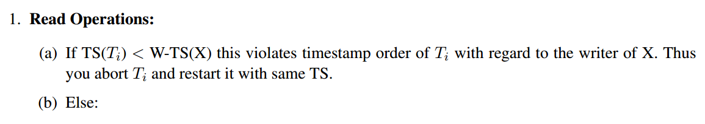

# [CMU 15-445/645 Intro to Database Systems (Fall 2017)](https://www.youtube.com/playlist?list=PLSE8ODhjZXjYutVzTeAds8xUt1rcmyT7x)

这个课程的slides和notes都很全，，我不太想记笔记了。

- [06 Database Storage](#06)
- [07 Buffer Pools](#07)
- [08 Hash Tables](#08)
- [09 Order-Preserving Trees](#09)
- [10 Query Processing](#10)
- [11 Sorting & Aggregation Algorithms + 12 Join Algorithms](#11)
- [13 Query Optimization](#13)
- [14 Parallel Execution](#14)
- [15 Embedded Database Logic](#15)
- [16 Concurrency Control Theory](#16)
- [17 Two-Phase Locking](#17)
- [18 Index Concurrency Control](#18)
- [19 Timestamp Ordering Concurrency Control](#19)
- [20 Multi-Version Concurrency Control](#20)
- [21 Logging Schemes](#21)
- [22 Database Recovery](#22)

&nbsp;   

## [06 Database Storage](https://www.youtube.com/watch?v=VLagoZ90ABk)

#### Do not use OS, DBMS wants to control things itself
- Specialized prefetching
- Buffer replacement policy
- Scheduling
- Flushing data to disk

> Of course, `mmap` is ok if you **only read data**.

- File Storage: 虽然文件系统无法对DB文件做优化，但是重写一个太麻烦了，效率提升一些，也不可移植。
- Page
  - Heap File Organization
  - Sequential/Sorted File Organization
  - Hashing File Organization
  - Log-Structured File Organization
- Tuple: each tuple in the database is assigned a unique identifier (page id + offset/slot)
  - Slotted Pages:
      - Header
      - Tuples' Offsets
      - ...
      - Tuple
  - Tuple Layout:
      - Header
      - Attr Data
- Storage Model

&nbsp;   

## [07 Buffer Pools](https://www.youtube.com/watch?v=sp_vhhgKQQg)

#### Row based storage model
- Advantages
  - Fast inserts, updates and deletes
  - Entire tuple query
- Disadvantages
  - Scan subsets of attributes

#### Column based storage model
- Advantages
  - Query processing
- Disadvantages
  - Slow for point query, insert, update adnd delete

#### Buffer Pool is an in-memory cache of pages read from disk.

#### Lock vs Latch(mutex)
**Lock** is a concept of logically protecting DB contents from transactions, while **Latch** is used to protect critical sections.

### Buffer Pool
- Buffer Pool Manager
  - race condition
  - prefetch
  - scan sharing: share the page with multiple queries
- Replacement Policy
  - LRU (using hash to speed up)
- Allocation Policy
- Other Memory Pools: DBMS needs memory other than tuples and indexes
  - Sorting, Join Buffer
  - Query Cache
  - Maintanence Buffer
  - Log Buffer
  - Dictionary Cache 

&nbsp;   

## [08 Hash Tables](https://www.youtube.com/watch?v=OFYVwCDQcVk)

&nbsp;   

## [09 Order-Preserving Trees](https://www.youtube.com/watch?v=Z1Qrsm7EfRw)

Table Index (Storage, Maintenance)

B+树快速重建：排序key，然后自底向上重建

Radix Tree

&nbsp;   

## [10 Query Processing](https://www.youtube.com/watch?v=JDo7_wOJnC4)

Query 组织成树。处理：流(one or batch)，前序遍历

Scan: sequential / index

&nbsp;   

## (Fall 2018) [11 Sorting & Aggregation Algorithms](https://www.youtube.com/watch?v=9wv-ZzClKks&list=PLSE8ODhjZXja3hgmuwhf89qboV1kOxMx7&t=0s&index=12) + [12 Join Algorithms](https://www.youtube.com/watch?v=9W8HnmSXE4s&index=12&list=PLSE8ODhjZXja3hgmuwhf89qboV1kOxMx7)

External Merge Sort: 1.小块排序，写回disk；2. 递归merge，注意内存只用3个page，2个输入，1个输出（输入是n个page，输出是2n个page，内存中的page看作output_iter）

### Join (2 table)

- Loop
  - Block
  - Index
- Sort & Merge
  - Sort Key
  - Scan Matching Keys（注意key是否是unique！！）
- Hash

&nbsp;   

## [13 Query Optimization](https://www.youtube.com/watch?v=3c-Bf7F7gnI)

### Query rewriting
- **Predicate pushdown**: Perform predicate filtering before join to reduce size of join
- **Projections**: Perform projections early to create smaller tuples and reduce intermediate results. You can project out all attributes except the ones requested or required (e.g. join attributes)
- **Join Orderings**: For an n-way join, there is Catalan number (approx 4^n) number of ways to do the join

### Cost Estimation => Choose Better Query Plan

&nbsp;   

## [14 Parallel Execution](https://www.youtube.com/watch?v=UKaKiqmX8N8)

&nbsp;   

## [15 Embedded Database Logic](https://www.youtube.com/watch?v=trWTqyJ3ZE8)

&nbsp;   

## [16 Concurrency Control Theory](https://www.youtube.com/watch?v=LNOomyGJp8Y)

Conflict Serializability - Dependency Graphs

&nbsp;   

## [17 Two-Phase Locking](https://www.youtube.com/watch?v=OYk3JHukTR8)

- 2PL generates acyclic precedence graph
- dirty read -> Strict 2PL

&nbsp;   

## [18 Index Concurrency Control](https://www.youtube.com/watch?v=poRiberfVxE)

- Intention Lock

### Phantom Problem

### Isolation Level

### Concurrent B+ Tree

&nbsp;   

## [19 Timestamp Ordering Concurrency Control](https://www.youtube.com/watch?v=xpQ9fQWa14c)
### Timestamp Concurrency Control
   
   
   
   

### Optimistic Concurrency Control

做一份copy，检查，提交。

&nbsp;   

## [20 Multi-Version Concurrency Control](https://www.youtube.com/watch?v=dK4PSHwf_ZA)

- Snapshot Isolation
- Version Storage
- GC
