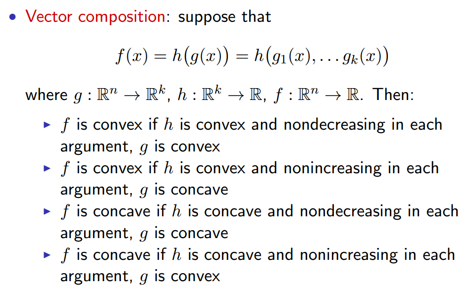

# [Convex Optimization: Fall 2018 - Machine Learning 10-725](http://www.stat.cmu.edu/~ryantibs/convexopt/)

- [Basics of convex analysis](#1)
- [First-order methods](#2)
- [Duality and the KKT conditions](#3)
- [Second-order methods](#4)
- [Advanced Topic](#5)
  - 
  - 
  - 

## Basics of convex analysis

### Convex optimization problems

Optimization problem:
$$
\begin{aligned}
& min_{x\in D} \qquad f(x) \\
& subject\ to \quad\ g_i(x) \le 0,\ i= 1,...m \\
& \qquad \qquad \quad\ \ h_j(x) = 0,\ j = 1,...r
\end{aligned}
$$
This is a **convex optimization problem** provided the functions $f​$ and $g_i​$ are convex, and $h_j​$ are affine:
$$
h_j(x) = a_j^T x + b_j
$$
For convex optimization problems, ***local minima are global minima***.

> $x​$ is feasible means $x \in D,\ g_i(x)\le 0\ and\ h_j(x) = 0$

#### 局部极小值就是全局极小值

$$
f(x) \le f(y),\quad ||x-y||_2 \le \rho
$$

then
$$
f(x) \le f(y)\ \ for\ all\ feasible\ y
$$
*Proof*:

suppose there is any $z \in D$ s.t.
$$
||x-z||_2 \gt \rho
$$
let $y = tx + (1-t)z$, where $0\le t \le 1$, we prove $y$ is feasible firstly.
$$
\begin{aligned}
g_i(y) = 
&\ g_i(tx+(1-t)z) \\
&\ \le tg_i(x) + (1-t)g_i(z) \\
&\ \le 0 \\
h_j(y) =
&\ a_j^T y + b_j = 0
\end{aligned}
$$
hence $y$ is feasible, besides we can choose a $t$ s.t.
$$
||x-y||_2 = (1-t) ||x-z||_2 \le \rho
$$
now we have
$$
\begin{alignat*}{2}
& f(x) && \le f(y) \\
& && = f(tx+(1-t)z) \\
& && \le t f(x) + (1-t)f(z) \\
\Rightarrow\ & f(x) && \le f(z)
\end{alignat*}
$$
hence $x$ is a global minima.

**Convex Sets**: $C \subseteq R^n$, s.t.
$$
x,y\in C \Rightarrow tx+(1-t)y \in C\quad for\ all\ 0 \le t \le 1
$$
**Convex Functions**:
$$
f(tx+(1-t)y) \le tf(x) + (1-t)f(y) \quad for\ all\ 0 \le t \le 1
$$
**Convex Combination** of $x_1, x_2,...x_k \in R^n​$:
$$
\theta_1x_1 + ... + \theta_kx_k,\qquad \sum \theta_i = 1
$$
**Convex hull** of a set C, $conv(C)$, is all convex combinations of elements.

凸集的例子：Hyperplane, Affine space, Polyhedron, Simplex, Cone.

### 凸集的重要性质

#### 1. Separating hyperplane theorem

两个不相交的凸集可以被一个超平面 separate（非strict，考虑 $\{y \le 0\}$ 和 $\{ y\ge \frac{1}{x},\ x\ge 0 \}$）

即 $C,D$ 是两个非空凸集，并且 $C \cap D = \phi$，那么存在 $a,b$ 使得
$$
\begin{aligned}
& C \subseteq \{ x: a^T x \le b \} \\
& D \subseteq \{ x: a^T x \ge b \} \\
\end{aligned}
$$

#### 2. Supporting hyperplane theorem

一个凸集的边界点（这里未给出明确定义）存在一个超平面，使得凸集在超平面的一侧。

即 $C$ 是一个非空凸集，对于 $x_0 \in boundary(C)$，那么存在 $a$，使得
$$
C \subseteq \{ x: a^T x \le a^T x_0 \}
$$

### 在凸集上封闭的运算

#### 1. Intersection：凸集的交是凸集

#### 2. 仿射变换（及其逆）

### 常见凸函数

- 凹函数的反：$-f$

- 二次型：$Q \succeq 0 \quad \Rightarrow \quad \frac{1}{2}x^TQx + b^Tx + c$ 为凸
- 均方损失函数：$||y-Ax||_2^2$，因为 $A^TA \succeq 0 $
- 指数：$e^{ax}$
- 幂函数
  - 凸：$a\ge 1\ or\ a\le 0$
  - 凹：$0\le a\le 1$
- 对数：凹
- 范数：$||x||_p = \sum_i (x_i^p)^{1/p}, \quad p\ge 1$
- 凸集的示性函数
- 支撑函数：$\forall C,\quad I_C(x) = max_{y\in C}\ x^Ty$ 为凸
- 最大值函数：$f(x) = max\ \{x_1,...x_n\}$
- 仿射函数：既凸又凹，$a^Tx+b$

### 凸函数的重要性质

#### 1. Epigraph characterization

凸函数 <=> 函数图像上部区域是凸的

#### 2. First-order characterization

若 $f$ 可导，则 $f$ 为凸当且仅当 $dom(f)$ 为凸，并且
$$
f(y) \ge f(x) + \bigtriangledown f(x)^T (y-x),\qquad x,y\in dom(f)
$$
推论：对与可导凸函数 $f$，$\bigtriangledown f = 0 \Leftrightarrow x\ minimize\ f$

#### 3. Second-order characterization

若 $f$ 二阶可导，则 $f$ 为凸当且仅当 $dom(f)$ 为凸，并且
$$
\bigtriangledown^2 f(x) \succeq 0,\qquad x,y\in dom(f)
$$
（$A \succeq 0​$ 表示 $A​$ 半正定）

#### 4. Jensen’s inequality

若 $f$ 为凸，$X$ 是 $dom(f)$ 上的随机变量，则
$$
f(E[X]) \le E[f(x)]
$$

### 保持凸性的运算

1. 系数非负的线性组合
2. Pointwise maximization：若干个凸函数的最大值（即凸集的交）
3. Partial minimization：若 $g(x, y)$ 为凸，且 $C$ 为凸，那么

$$
f(x) = min_{y\in C}\ g(x, y)
$$

为凸。

4. 仿射变换：$f$ 为凸 $\Rightarrow$ $f(Ax+b)$ 为凸
5. 复合函数:

6. Vector Composition:

### Optimization Terminology

$$
\begin{aligned}
& min_{x\in D} \qquad f(x) \\
& subject\ to \quad\ g_i(x) \le 0,\ i= 1,...m \\
& \qquad \qquad \quad\ \ Ax = b
\end{aligned}
$$

其中 $f$ 和 $g_i$ 均为凸，$D = dom(f) \cap \bigcap_i dom(g_i)$

- $f$ 称为 目标函数
- $g_i$ 称为 不等式约束
- 若 $x\in D,\ g_i(x)\le 0\ and\ Ax = b$，则 $x$ 称为 *feasible point*
- $f(x)$ 的最小值（若存在）记为 $f^* =f(x^*)$，$x^*$ 称为问题的解

所有的解的集合记作 $X_{opt}$，则 $X_{opt}$ 是凸的。

重写约束条件：
$$
min_x\ f(x)\quad subject\ to\ x\ in\ C
$$
其中 $C = \{ x: g_i(x)\le 0,\ Ax = b \}$ 是凸集

### First-order optimality condition

$$
\bigtriangledown_{x^*}^T (x - x^*) \ge 0,\quad for\ all\ x\in C
$$
特别地，当 $C = R^n$ 时，有
$$
\bigtriangledown f(x^*) = 0
$$
*proof*:
$$
f(x) - f(x^*) = \bigtriangledown_{x^*}^T (x-x_0) + O(||x-x_0||^2)
$$
于是条件与 $x^*$ 为 *local minima* 等价，又注意到 *local minima* 也即是 *global minima*

## First-order methods

## Duality and the KKT conditions

## Second-order methods

## Advanced Topic

