# 西瓜书阅读笔记

## Ch01 绪论

[NFL定理 - No Free Lunch Theorem](https://en.wikipedia.org/wiki/No_free_lunch_theorem)

意义在于：脱离具体问题，空泛地谈论 “什么学习算法更好” 毫无意义。

六七十年代：**符号主义**

八十年代：

​           **从样例中学习**：监督学习、无监督学习等本书大部分内容。

​		包括:
- 决策树
- 基于逻辑的学习（归纳逻辑程序设计）
- 基于神经网络的连接主义学习（著名的BP算法）

九十年代：统计学习（[支持向量机](#6)）

习题1.4 

​       还是假设二分类问题，假设 $f$ 均匀分布，且

​       $\ell (h(x), f(x))=0\quad when\ h(x)=f(x)$

​       $let\ \ \ell(h(x), f(x))=\ell (0,1)=\ell\quad when\ h(x)\neq f(x)$
$$
\begin{aligned}
\sum_f E_{ote}(\mathfrak{L}_a|X,f)&
=\sum_f \sum_h \sum_{\pmb x \in \mathcal{X}-X}P(x) \ell (h(x), f(x)) P(h|X,\mathfrak{L}_a)\\&
=\sum_{\pmb x \in \mathcal{X}-X}P(x) \sum_h P(h|X,\mathfrak{L}_a) \sum_f \ell (h, f)\\&
=\sum_{\pmb x \in \mathcal{X}-X}P(x) \sum_h P(h|X,\mathfrak{L}_a) 2^{|\mathcal{X}|-1}\ell\\&
=2^{|\mathcal{X}|-1}\ell \sum_{\pmb x \in \mathcal{X}-X}P(x)
\end{aligned}
$$

## Ch02 模型评估与选择

[（转）第二章 模型评估与选择](http://cweihang.cn/ml/melon/ch02.html)   

### 2.1 经验误差与过拟合

学习器在训练集上的误差称为 “训练误差” (training error) 或 “**经验误差**” (empirical error)，在新样本上的误差称为 “泛化误差” (generalization error)。我们**希望**得到泛化误差小的学习器，然而**实际**能做的工作是使经验误差最小化。

### 2.2 评估方法

> 测试集应该尽可能与训练集互斥。

#### 2.2.1 留出法

#### 2.2.2 k 折交叉验证

#### 2.2.3 自助法

#### 2.2.4 调参与最终模型

### 2.3 性能度量

### 2.4 比较检验

#### 2.4.1 假设检验

#### 2.4.2 交叉验证 t 检验

#### 2.4.3 McNemar 检验

#### 2.4.4 Friedman 检验 与 Nemenyi 后续检验

### 2.5 偏差与方差

## Ch03 线性模型

### 3.1 基本形式

$ \pmb x=(x_1;x_2;...;x_d)$ 由 $d$ 个属性描述。

线性模型试图学得一个通过属性的线性组合来进行预测的函数。

即 

$\qquad\qquad\qquad\qquad\qquad f(\pmb x)=\pmb {w^Tx}+b$

$w$ 和 $b$ 学得之后，模型就得以确定。

### 3.2 线性回归

试图学得

$\qquad\qquad\qquad\qquad\qquad f(\pmb {x})=\pmb w^T\pmb x+b  $，使得 $f(\pmb x)\simeq y$

显然关键在于如何衡量 $f(x)$ 与 $y$ 之间的误差，均方误差是回归任务中最常用的性能度量，也就是使用最小二乘法来进行估计。

记$\qquad\qquad\quad \hat{\pmb w}=(\pmb w;b)$
$$
\pmb X=\left (\begin{array}{c:c}
\begin{matrix}
 x_{11}   & x_{12}   & \cdots   & x_{1d}   \\
 x_{21}   & x_{22}   & \cdots   & x_{2d}   \\
 \vdots   & \vdots   & \ddots   & \vdots   \\
 x_{m1}   & x_{m2}   & \cdots   & x_{md}   \\
\end{matrix}&
\begin{matrix}
1      \\
1      \\
\vdots \\
1      \\
\end{matrix}
\end{array}
\right )
=\begin{pmatrix}
\pmb x_1^T   & 1        \\
\pmb x_1^T   & 1        \\
\vdots       & \vdots   \\
\pmb x_1^T   & 1        \\
\end{pmatrix}
$$
$\qquad\qquad\qquad \pmb y=(y_1;y_2;...;y_m)$

于是有
$$
\begin{aligned}
(w^*,b^*)&
=argmin_{(w,b)}\sum_i (f(\pmb{x_i})-y_i)^2\\&
=argmin_{(w,b)}\sum_i (\pmb w^T\pmb{x_i}+b-y_i)^2\\&
=argmin_{(w,b)}\sum_i (\hat{\pmb w}^T\pmb x_i-y_i)^2\\&
=argmin_{(w,b)}(\pmb X\hat{\pmb w}-\pmb y)^T(\pmb X\hat{\pmb w}-\pmb y)
\end{aligned}
$$
令 $E_{\hat{\pmb w}}=(\pmb X\hat{\pmb w}-\pmb y)^T(\pmb X\hat{\pmb w}-\pmb y)$，对 $\hat{\pmb w}$ 求导并解出零点

&emsp;&emsp;&emsp;&emsp;&emsp;&emsp;&emsp;&emsp;&emsp;&emsp;&emsp;&emsp;&emsp;&emsp;&emsp;&emsp;&emsp;&emsp;&emsp;&emsp;&emsp;

$$
\begin{aligned}
\frac{\partial{E_{\hat{\pmb w}}}}{\partial{\hat{\pmb w}}}&
=\frac{\partial}{\partial{\hat{\pmb w}}}(tr((\pmb X\hat{\pmb w}-\pmb y)^T(\pmb X\hat{\pmb w}-\pmb y)))\\&
=\frac{\partial}{\partial{\hat{\pmb w}}}(tr(\hat{\pmb w}^T\pmb X^T\pmb X\hat{\pmb w}-\pmb y^T\pmb X\hat{\pmb w}-\hat{\pmb w}^T\pmb X^T\pmb y+\pmb y^T\pmb y))\\&
=\frac{\partial{tr(\hat{\pmb w}\pmb I\hat{\pmb w}^T\pmb X^T\pmb X)}}{\partial \hat{\pmb w}}-\pmb X^T\pmb y-\pmb X^T\pmb y\\&
=2\pmb X^T(\pmb X\hat{\pmb w}-\pmb y)
\end{aligned}
$$
若 $\pmb X^T\pmb X$ 可逆，令 $\hat{\pmb x}=(\pmb x;1)$，则最终学得的多元线性回归模型为
&emsp;&emsp;&emsp;&emsp;&emsp;&emsp;&emsp;&emsp;&emsp;&emsp;&emsp;&emsp;&emsp;&emsp;&emsp;&emsp;&emsp;&emsp;&emsp;$\hat{\pmb w}=(\pmb X^T\pmb X)^{-1}\pmb X^T\pmb y$
&emsp;&emsp;&emsp;&emsp;&emsp;&emsp;&emsp;&emsp;&emsp;&emsp;&emsp;&emsp;&emsp;&emsp;&emsp;&emsp;&emsp;&emsp;&emsp;$f(\hat{\pmb x})=\hat{\pmb x}^T(\pmb X^T\pmb X)^{-1}\pmb X^T\pmb y$

然而通常 $\pmb X^T\pmb X$ 不可逆，此时可解出多个 $\hat{\pmb w}$，选择哪一个由学习算法的归纳偏好决定，常见的做法是引入**正则化(regularization)项**。

考虑单调可微函数 $g(\cdot)$，令

$y=g^{-1}(\pmb w^T\pmb x+b)$，这样的模型称为 “广义线性模型”。

### 3.3 对数几率回归

对于**分类任务**，我们只需找一个**单调可微函数将**分类任务的**真实标记 $y$** 与**线性回归模型的预测值**联系起来。

对数几率函数 $y=\frac{1}{1+e^{-z}}$

$$
\begin{aligned}
ln\frac{y}{1-y}=\pmb w^T\pmb x+b
\end{aligned}
$$
该模型称为 “对数几率回归”，用线性回归模型的预测结果去逼近真实标记的对数几率。
$$
ln\frac{p(y=1|\pmb x)}{p(y=0|\pmb x)}=\pmb w^T\pmb x+b
$$
记 $\pmb \beta=(\pmb w;b)$，通过极大似然估计得

。。。。书上写的什么玩意。。。

[（转）机器学习系列-Logistic回归：我看你像谁 （下篇）](https://zhuanlan.zhihu.com/p/22692266)

[（转）机器学习－逻辑回归与最大似然估计](http://www.hanlongfei.com/%E6%9C%BA%E5%99%A8%E5%AD%A6%E4%B9%A0/2015/08/05/mle/)

### 3.4 线性判别分析

LDA的思想非常朴素：给定训练样例集，设法将样例投影到一条直线上，使得同类样例的投影点尽可能接近，异类样例 的投影点尽可能远离。

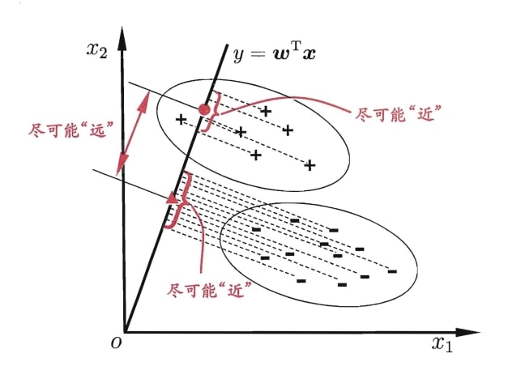

### 3.5 多分类学习

## Ch04 决策树

### 4.1 基本流程

根结点包含样本全集，叶结点对应决策结果，其他节点对应属性测试。

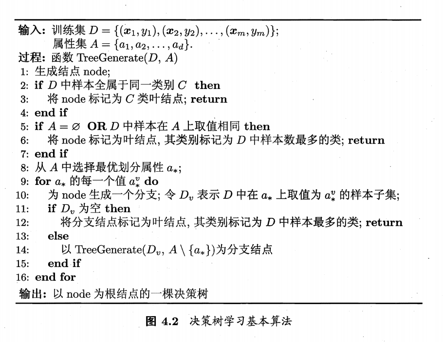

$a_*$ 的选择在 4.2 部分说明。

### 4.2 划分选择

一般而言，随着划分过程不断进行，我们希望决策树的分支结点所包含的样本尽可能属于同一类别，即结点的"纯度"(purity)越来越高。

#### 4.2.1 信息增益

"信息熵"(information entropy)是度量样本集合纯度最常用的一种指标。假定当前样本集合 $D$ 中第 $k$ 类样本所占的比例为 $p_k\ (k=1,2,...,|\mathcal{Y}|)$，则 D 的**信息熵**定义为
$$
Ent(D)=-\sum_{k=1}^{\mathcal{|Y|}} p_klog_2p_k
$$

**$Ent(D)$ 的值越小，则 $D$ 的纯度越高。**

假设离散属性 $a$ 有 $V$ 个可能的取值 $\{a^1,a^2,...,a^V\}$，若使用 $a$ 来对样本集 $D$ 进行划分，则会产生 $V$ 个分支结点，其中第 $v$ 个分支结点包含了 $D$ 中所在属性 $a$ 上取值为 $a^v$ 的样本，记为 $D^v$。

定义：**信息增益** (用属性 $a$ 来对样本集 $D$ 进行划分)
$$
Gain(D,a)=Ent(D)-\sum_{v=1}^V \frac{|D^v|}{|D|} Ent(D^v)
$$

> 注：ID3决策树算法就是以信息增益为准则来选择划分属性。
>
> **（试图让分支的"加权平均熵"最小，当前熵与分支熵的差称作"信息增益"）**

一般而言，信息增益越大，则意味着使周属性 $a$ 来进行划分所获得的"纯度提升"越大。

即在算法第8行选择属性
$$
a_*=argmax_{a\in A}Gain(D,a)=argmin_{a\in A}\sum_{v=1}^V\frac{|D^v|}{|D|}Ent(D^v)
$$
**即分支的加权平均熵最小。**

#### 4.2.2 增益率

注意到：**信息增益准则对可取值数目较多的属性有所偏好**，对其修正。

定义**增益率**：
$$
\begin{aligned}
& Gain\_ratio(D,a)=\frac{Gain(D,a)}{IV(a)}\ ,  \\
& IV(a)=-\sum_{v=1}^V\frac{|D^v|}{|D|}log_2\frac{|D^v|}{|D|}
\end{aligned}
$$
注意到：**增益率准则对可取值数目较少的属性有所偏好。**

**C4.5决策树算法**：先从候选划分属性中找出信息增益高于平均水平的属性，再从 中选择增益率最高的。

#### 4.2.3 基尼指数

**CART决策树算法**使用"基尼系数"来选择划分属性。

定义基尼系数：
$$
\begin{aligned}
Gini(D)&
= \sum_{k=1}^{|\mathcal{Y}|}\sum_{k^{'}\neq k}p_kp_{k^{'}}    \\&
= 1-\sum_{k=1}^{|\mathcal{Y}|}p_k^2
\end{aligned}
$$
直观来说，$Gini(D)$ 反映了从数据集 $D$ 中随机选取2个样本，不属于同类的概率。因此，$Gini(D)$ 越小，则数据集 $D$ 的纯度越高。

属性 $a$ 的基尼系数定义为：
$$
Gini\_index(D,a)=\sum_{v=1}^V \frac{|D^v|}{|D|}Gini(D^v)
$$
**CART决策树算法**：在候选属性集合 $A$ 中，选择那个使得划分后基尼指数最小的属性作为最优划分属性，即 $a_*=argmin_{a\in A}\ Gini\_index(D,a)$.

### 4.3 剪枝处理 (pruning)

#### 4.3.1 预剪枝

#### 4.3.2 后剪枝

### 4.4 连续与缺失值

#### 4.4.1 连续值处理

#### 4.4.2 缺失值处理

### 4.5 多变量决策树

## Ch05 神经网络

### 5.1 神经元模型

映射，阈值，激活函数。

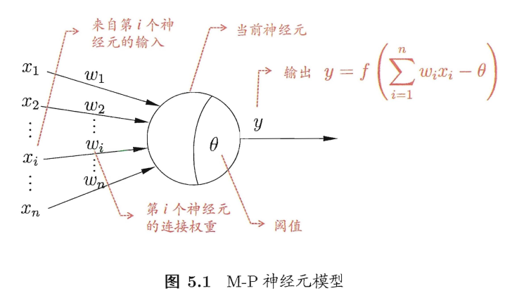

### 5.2 感知机与多层网络

感知机(Perceptron)由两层神经元组成。输入层接收外界输入信号后传递给输出层，输出层是 M-P 神经元。

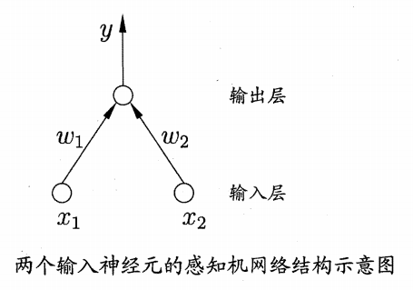

给定训练集，权重 $w_i$ 以及阈值 $\theta$ 可以通过学习得到。

（注：事实上，阈值 $\theta$ 可以看做是固定输入为 $-1.0$ 的哑结点，所对应的权重为 $w_{n+1}$，即 $\theta$）

感知机学习规则：

对于训练样本 $(\pmb x,y)$，若当前感知机的输出为 $\hat y$，则感知机权重调整为
$$
w_i+=\eta(y-\hat y)x_i
$$
其中 $\eta\in(0,1)$ 称为学习率。

> 由于激活函数接受的是"上一层输入的加权和"这一愚蠢的事实，我们需要多层映射来解决非线性可分问题。

多层神经网络，其中输入层神经元接收外界输入，隐层与输出层神经元对信号进行 加工，最终结果由输出层神经元输出。

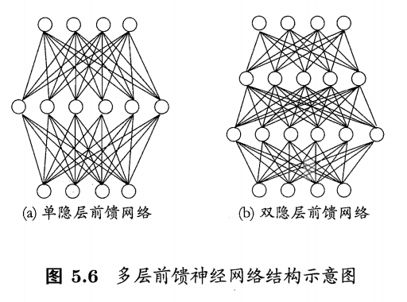

### 5.3 误差逆传播算法

多层神经网络需要更强大的学习算法。

误差逆传播（BP算法）

$X\subset \mathbb R^d,Y\subset \mathbb R^l$，即输入由 $d$ 个属性描述，输出为 $l$ 维实值向量。

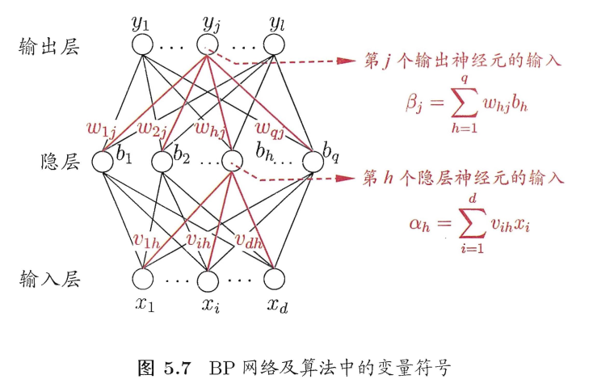

需要确定的参数：输入层到隐层的 $d\times q$ 个权值，$q$ 个隐层神经元的阈值，隐层到输出层的 $q\times l$ 个权值，$l$ 个输出层的阈值。激活函数 $f$ 使用 Sigmoid 函数。

对于任意参数 $v$ 的更新方式：$v\gets v+\Delta v$

假设训练输出为 $\hat {\pmb y}_k=(\hat y_1^k,\hat y_2^k,...,\hat y_l^k),\quad \hat y_j^k=f(\beta_j-\pmb \theta_j)$

则均方误差记为：
$$
E_k=\frac{1}{2}\sum_{j=1}^l(\hat y_j^k-y_j^k)^2
$$
**BP 算法基于梯度下降(gradient descent)策略，以目标的负梯度方向对参数进行调整。**

例如：对误差 $E_k$ 和 权重 $w_{hj}$，给定学习率 $\eta$，有
$$
\begin{aligned}
\Delta w_{hj}
& = -\eta \frac{\partial E_k}{\partial w_{hj}}            \\
& = -\eta \frac{\partial E_k}{\partial {\hat y_j^k}}  \cdot \frac{\partial {\hat y_j^k}}{\partial \beta_j} \cdot \frac{\partial \beta_j}{\partial w_{hj}}                                                   \\
& = -\eta \hat y_j^k(1-\hat y_j^k)(\hat y_j^k - y_j^k) b_h
\end{aligned}
$$
其余参数同理。

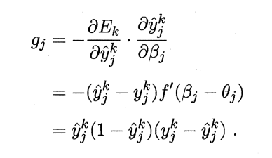

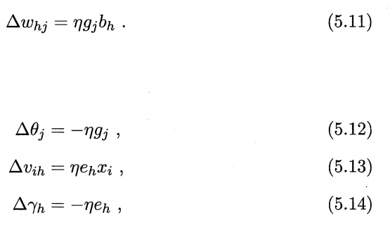

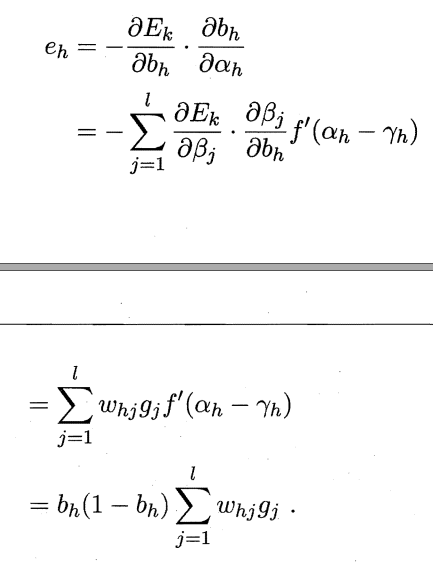

对每个训练样例，BP算法流程如下：

1. 根据网络，输入映射到输出。
2. 计算输出层的误差。调整权重和阈值。
3. 迭代执行，知道某些条件。

 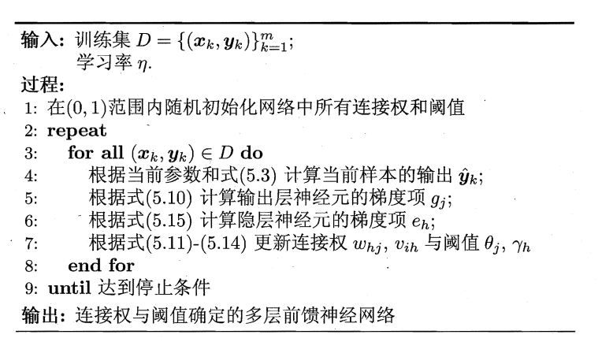

累积BP - 标准BP

### 5.4 全局最小与局部极小

### 5.5 其他常见神经网络

### 5.6 深度学习

## Ch06 支持向量机

### 6.1 间隔与支持向量

给定训练样本集 $D=\{(x_1,y_1),(x_2,y_2),...,(x_m,y_m)\},\ y_i\in \{-1,+1\}$，分类学习最基本的想法就是基于训练集 $D$ 在样本空间中找到一个划分超平面，将不同类别的样本分开。

选择图中红色（加粗），因为该划分对训练样本局部扰动的"容忍"更好。

划分超平面：
$$
\pmb w^T\pmb x+b=0
$$
令
$$
\begin{equation}
\left\{
        \begin{array}{lr}
            \pmb w^T\pmb x_i + b = 0, & y_i=+1      \\
            \pmb w^T\pmb x_i + b = 0, & y_i=-1      \\
        \end{array}
\right.
\end{equation}
$$
如图所示，距离超平面最近的这几个训练样本点使上式的等号成立。它们被称为"支持向量"(support vector)，两个异类支持向量到超平面的距离之和（称为 “间隔”）为
$$
\gamma=\frac{2}{||\pmb w||}
$$
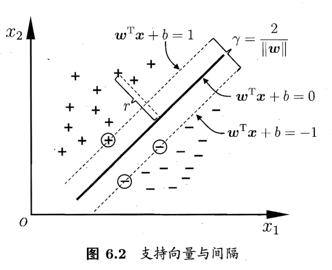

**目标：找到具有"最大间隔"的划分超平面。**即
$$
\begin{aligned}
& max_{\pmb w,b}\frac{2}{||\pmb w||}   \\
& s.t.\ y_i(\pmb w^T\pmb x_i+b)\ge1,\quad i=1,2,...,m.
\end{aligned}
$$
则支持向量机的基本型可写为：
$$
\begin{aligned}
& min_{\pmb w,b}\ \frac{1}{2}||\pmb w||^2   \\
& s.t.\ y_i(\pmb w^T\pmb x_i+b)\ge1,\quad i=1,2,...,m.
\end{aligned}
$$

### 6.2 对偶问题

使用[广义拉格朗日乘数法](https://zh.wikipedia.org/wiki/%E5%8D%A1%E7%BE%85%E9%9C%80%EF%BC%8D%E5%BA%AB%E6%81%A9%EF%BC%8D%E5%A1%94%E5%85%8B%E6%A2%9D%E4%BB%B6)，
$$
L(\pmb w,b,\pmb \alpha)=\frac{1}{2}||\pmb w||^2+\sum_{i=1}^m\alpha_i(1-y_i(\pmb w^T\pmb x+b))\ ,
$$
得到对偶问题
$$
\begin{aligned}
& max_\alpha\ \sum_{i=1}^m \alpha_i-\frac{1}{2}\sum_{i=1}^m\sum_{j=1}^m\alpha_i\alpha_jy_iy_j\pmb x_i^T\pmb x_j    \\
& s.t.\ \sum_{i=1}^m\alpha_iy_i=0,\quad \alpha_i\ge0,\quad i=1,2,...,m.
\end{aligned}
$$
解出 $\pmb \alpha$ 后，得到模型为
$$
\begin{aligned}
f(x) &
= \pmb w^T\pmb x+b    \\&
= \sum_{i=1}^m\alpha_iy_i\pmb x_i^T\pmb x+b
\end{aligned}
$$
注意到：对任意训练样本 $(\pmb x_i,y_i)$，总有 $\alpha_i=0$ 或 $y_if(\pmb x_i)=1$。

这显示出支持向量机的一个重要性质：训练完成后，大部分的训练样本都不需保留，最终模型仅与支持向量有关。

求解对偶问题：SMO算法 - 局部调整（一个组合极值的思路，不过怎么收敛呢？？？）

### 6.3 核函数

若不存在超平面划分，可将样本从**原始空间映射到一个更高维的特征空间**，使得样本在这个特征空间内线性可分。幸运的是，如果原始空间是有限维，即属性数有限，那么一定存在一个高维特征空间使样本可分。

令 $\phi(\pmb x)$ 表示将 $\pmb x$ 映射后的特征向量，则模型表示为
$$
f(\pmb x)=\pmb w^T\phi(\pmb x)+b
$$
其对偶问题为
$$
\begin{aligned}
& max_{\pmb \alpha}\ \sum_{i=1}^m\alpha_i-\frac{1}{2}\sum_{i=1}^m\sum_{i=1}^m\alpha_i\alpha_jy_iy_j\phi(\pmb x_i)^T\phi(\pmb x_j)    \\
& s.t.\ \sum_{i=1}^m\alpha_iy_i=0,\quad \alpha_i\ge 0,\quad i=1,2,...,m.
\end{aligned}
$$
$\kappa$ 是核函数当且仅当核矩阵 $K$ 是半正定的（即特征值均非负）。

参考 [支持向量机导论3: 核函数特征空间](http://jacoxu.com/%E6%94%AF%E6%8C%81%E5%90%91%E9%87%8F%E6%9C%BA%E5%AF%BC%E8%AE%BA3-%E6%A0%B8%E5%87%BD%E6%95%B0%E7%89%B9%E5%BE%81%E7%A9%BA%E9%97%B4/)

[Mercer's theorem](https://en.wikipedia.org/wiki/Mercer%27s_theorem)

> 解释：核矩阵是半正定这一事实保证了高维空间存在。

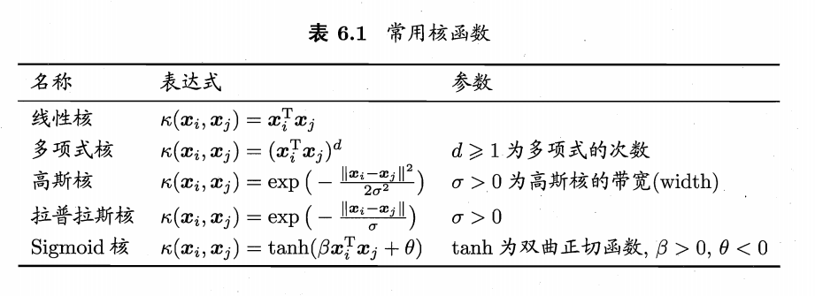

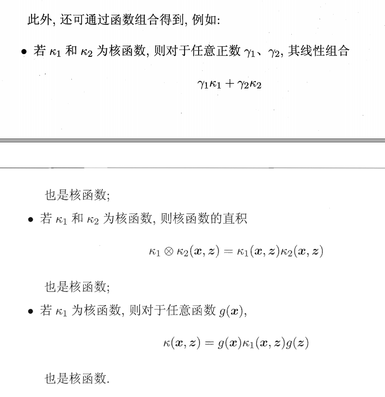

### 6.4 软间隔与正则化

### 6.5 支持向量与回归

### 6.6 核方法

## Ch07 贝叶斯分类器

### 7.1 贝叶斯决策论

$\mathcal{Y}=\{c_1,c_2,...,c_N\}$，$\lambda_{ij}$ 是将一个真实标记为 $c_j$ 的样本误分类为 $c_i$ 所产生的损失。

将样本 $x$ 分类为 $c_i$ 所产生的期望损失，即在样本 $x$ 上的 “条件风险”
$$
R(c_i|\pmb x)=\sum_{i=1}^N \lambda_{ij}P(c_j|\pmb x)
$$
寻找一个判定准则 $h:\mathcal X \mapsto \mathcal Y$ 以最小化总体风险
$$
R(h)=\mathbb E_{\pmb x}[R(h(\pmb x)|\pmb x)]
$$
贝叶斯判定准则：**为最小化总体风险，只需在每个样本上选择那个能使条件风险 $R(c|\pmb x)$ 最小的类别标记。**即
$$
h^*(\pmb x)=argmin_{c\in\mathcal Y}R(c|\pmb x)
$$
$1-R(h^*)$ 反映了分类器所能达到的最好性能，即通过机器学习所能产生的模型精度的理论上限。

特别地，对于0-1损失函数。。。。

### 7.2 极大似然估计

估计类条件概率的一种常用策略是先假定其具有某种确定的概率分布形式，再基于训练样本对概率分布的参数进行估计。

假设关于类别 $c$ 的类条件概率 $P(\pmb x|c)$ 具有确定的形式并被参数向量 $\pmb \theta_c$ 唯一确定，我们对 $\pmb \theta_c$ 进行最大似然估计。

**本书注：该模型的准确性严重依赖于所假设的概率分布形式是否符合潜在的真实数据分布。在现实应用中，欲做出能较好地接近潜在真实分布的假设，往往需在一定程度上利用关于应用任务本身的经验知识，否则若仅凭"猜测"来假设概率分布形式，很可能产生误导性的结果。**

### 7.3 朴素贝叶斯分类器

引入一个较强的条件独立性假设。

平滑。

### 7.4 半朴素贝叶斯分类器

属性条件独立性假设很难成立。

> 适当考虑一部分属性间的相互依赖信息，从而既不需进行完全联合概率计算，又不至于彻底忽略了比较强的属性依赖关系。

- ODE 独依赖
- SPODE 超父独依赖
- TAN
  - 为每个边赋值权重为 “条件互信息”
  - 最大生成树，保留强相关属性之间的依赖性
- AODE

### 7.5 贝叶斯网

使用 DAG 来刻画属性之间的依赖关系。并使用条件概率表来描述属性的联合概率分布。

$B=\langle G,\Theta \rangle$，参数 $\Theta$ 定量描述这种依赖关系，假设属性 $x_i$ 在 $G$ 中的父节点集为 $\pi_i$，则 $\Theta$ 包含了每个属性的条件概率表 $\theta_{x_i|\pi_i}=P_B(x_i|\pi_i)$

#### 7.5.1 结构

贝叶斯网假设每个属性与它的非后裔属性独立，联合概率分布为
$$
P_B(x_1,x_2,...,x_d)=\prod_{i=1}^d P_B(x_i|\pi_i)=\prod_{i=1}^d\theta_{x_i|\pi_i}
$$
为了分析有向图中变量间的条件独立性，使用 “有向分离”，转换为无向图：

- 找出有向图中的所有 V 型结构，在 V 型结构的两个父节点之间加一条无向边。
- 将所有有向边改为无向边。

称为 “道德图”。

定义：在道德图上有变量 $x,y$ 和变量 $\pmb z=\{z_i\}$，若变量 $x$ 和 $y$ 能在图上被 $\pmb z$ 分开，即从道德图中将变量 $\pmb z$ 去除后，$x$ 和 $y$ 不连通，则称变量 $x$ 和 $y$ 被 $\pmb z$ 有向分离，$x\perp y\ |\ \pmb z$ 成立。

#### 7.5.2 学习

若网络结构己知，即属性间的依赖关系己知，则贝叶斯网的学习过程相对简单，只需通过对训练样本"计数"，估计出每个结点的条件概率表即可。

贝叶斯网学习的首要任务就是根据训练数据集来找出结构最"恰当"的贝叶斯网。

常用方法是 “评分搜索”：定义一个评分函数(score function)，以此来评估贝叶斯网与训练数据的契合程度，然后基于这个评分函数来寻找结构最优的贝叶斯网。显然，评分函数引入了关于我们希望获得什么样的贝叶斯网的归纳偏好。

评分函数针对编码贝叶斯网络的字节数，以及贝叶斯网络所对应的概率分布的描述效果。（更短的编码有什么含义？？？）

#### 7.5.3 推断

网络复杂时，难以进行精确推断。“近似推断” 通过降低精度要求，在有限时间内求得近似解。在现实应用中，贝叶斯网的近似推断常使用**吉布斯采样**来完成，这是一种随机采样方法。

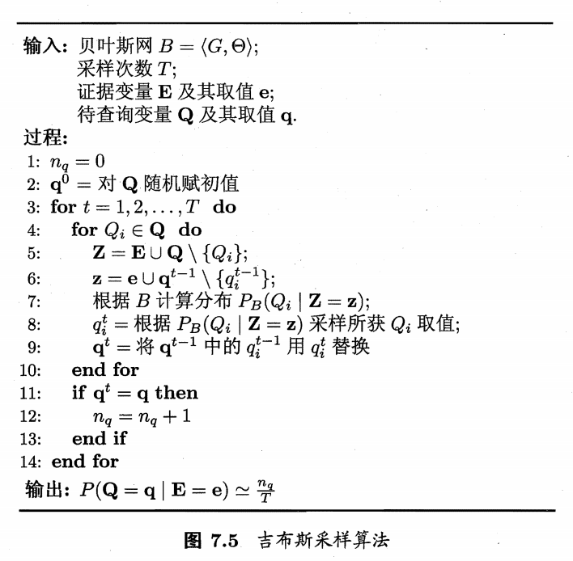

（注：好多东西没有定义，我都不知道这说的啥玩意，看醉了。。。）

### 7.6 EM算法

## Ch08 集成学习

### 8.1 个体与集成

### 8.2 Boosting

### 8.3 Bagging与随机森林

### 8.4 结合策略

### 8.5 多样性

## Ch09 聚类

### 9.1 聚类任务

在"无监督学习"中，训练样本的标记信息是未知的，目标是通过对无标记训练样本的学习来揭示数据的内在性质及规律。

聚类试图将数据集中的样本划分。

### 9.2 性能度量

### 9.3 距离计算

距离的一般度量：

- $d(x,y)\ge 0,\quad d(x,y)=0\quad iff\quad x=y$
- $d(x,y)=d(y,x)$
- $d(x,z)\le d(x,y)+d(y,z)$

距离的各种形式。

### 9.4 原型聚类

算法先对原型进行初始化，然后迭代更新求解。

#### 9.4.1 k均值算法

样本集 $D=\{\pmb x_1,\pmb x_2,...,\pmb x_m\}$，类划分 $\mathcal C=\{C_1,C_2,...,C_k\}$，最小平方误差为
$$
E=\sum_{i=1}^k\sum_{\pmb x\in C_i}||\pmb x-\pmb \mu_i||^2
$$
其中 $\pmb \mu_i=\frac{1}{|C_i|}\sum_{\pmb x\in C_i}\pmb x$ 是类 $C_i$ 均值向量。

**k-means算法过程**：

输入：样本集 $D=\{x_1,x_2,...,x_m\}$，聚类簇数 $k$

输出：簇划分 $\mathcal C=\{C_1,C_2,...,C_k\}$

1. 从 $D$ 中随机选择 $k$ 个样本作为初始均值向量 $\{\pmb \mu_1,\pmb \mu_2,..,\pmb \mu_k\}$
2. 遍历所有样本，将其划分到距离最小的那个集合
3. 重新计算每个集合的均值向量，直到均值向量不再变化（或者其他条件）

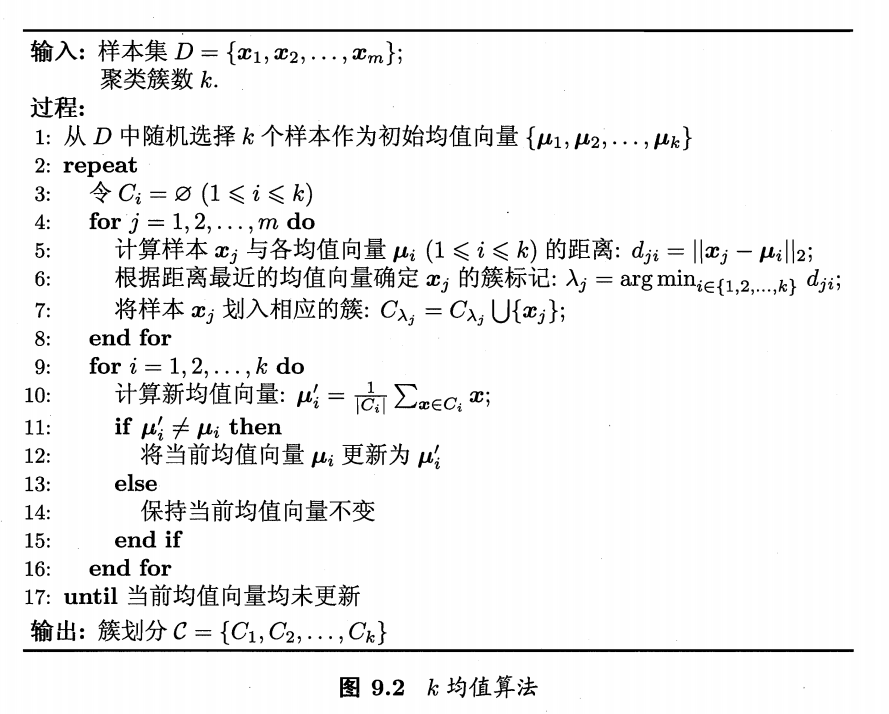

（注：贪心策略是否能达到最小化平方误差？？？试图证明，好像很麻烦，看起来并不是最小化误差）

#### 9.4.2 学习向量量化

**假设样本有标记。**

LVQ算法流程：

1. 随机初始化 $q$ 个原型向量，并设定他们分别为第 $1,2,...,q$ 类
2. 随机选择一个样本，寻找离他最近的原型向量
3. 更新该表示向量——如果原型向量所属类别和样本相同，就靠近该样本，否则远离该样本
4. 重复直到满足条件

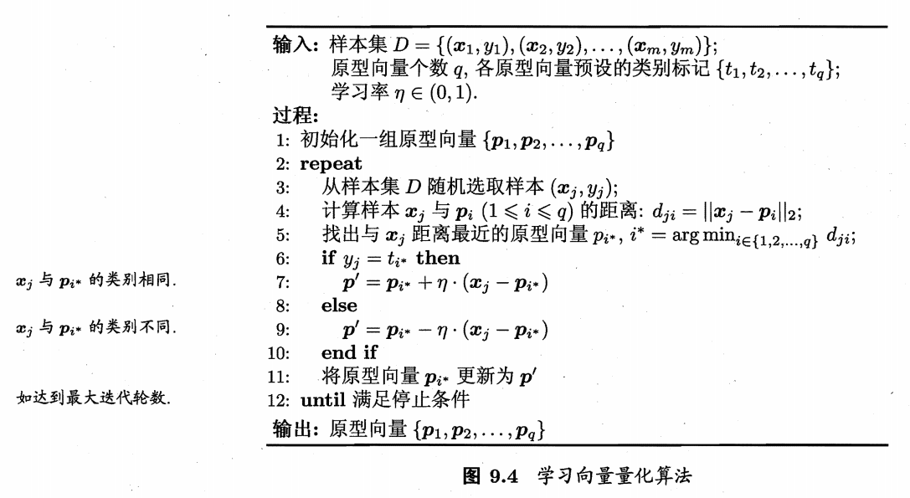

在学得一组原型向量 $\{\pmb p_1,\pmb p_2,...,\pmb p_q\}$ 后，即可实现对样本空间 $\mathcal X$ 的簇划分：对任意样本 $\pmb x$，加入与其距离最近的原型向量所代表的的簇中。

换言之，每个原型向量 $\pmb p_i$ 定义了与之相关的一个区域 $R_i$，该区域中每个样本与 $\pmb p_i$ 的距离不大于该样本与其他原型向量 $\pmb p_j\ (i\neq j)$ 的距离，即
$$
R_i=\{\pmb x\in\mathcal X\ |\ ||\pmb x-\pmb p_i||\le||\pmb x-\pmb p_j||,\ i\neq j\}
$$
由此形成了对样本空间 $\mathcal X$ 的簇划分 $\{R_1,R_2,...,R_q\}$，该划分称为 "Voronoi剖分"(Voronoi tessellation).

#### 9.4.3 高斯混合聚类

### 9.5 密度聚类

### 9.6 层次聚类

## Ch10

## Ch11

## Ch12

## Ch13

