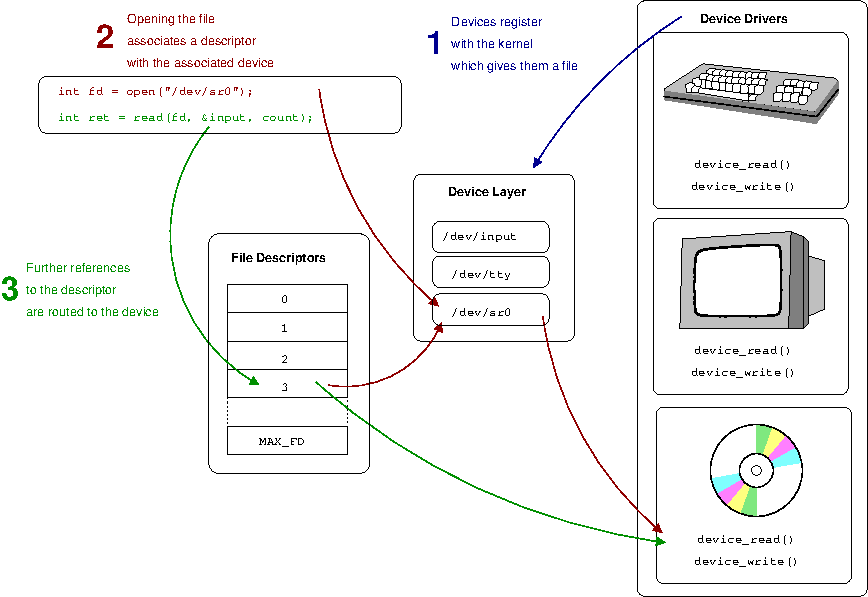

# [Computer Science from the Bottom Up](https://www.bottomupcs.com/index.xhtml)

（*这本感觉还不错，但是应该是给低年级看的，就打算快快过一遍*。）

## 1. General Unix and Advanced C

### File Descriptors Abstraction

   
**The file descriptor is the gateway into the kernel's abstractions of underlying hardware.**

