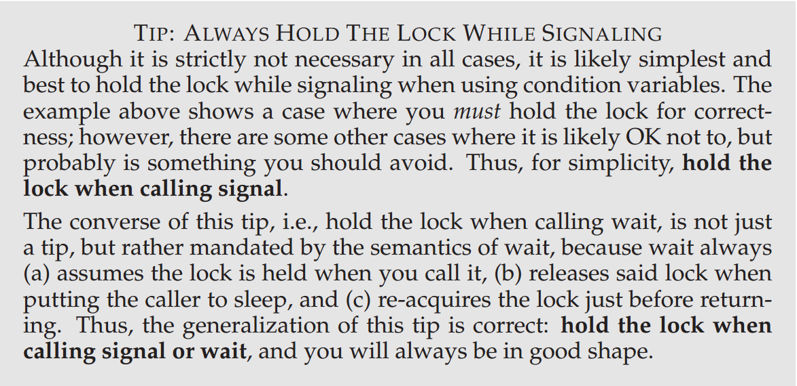

# [Operating Systems: Three Easy Pieces](http://pages.cs.wisc.edu/~remzi/OSTEP/#book-chapters)

## 2. Concurrency

### 30. Condition Variables

这个其实很奇怪，我研究了一下，博客写在这里：[探究 “条件变量signal时是否需要持有mutex”](https://blog.csdn.net/rsy56640/article/details/84953204)

>尤其是参考最后《Programming with POSIX Threads》作者的论坛讨论

