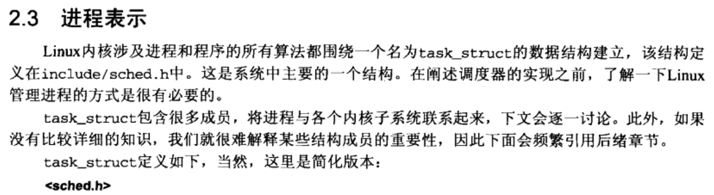
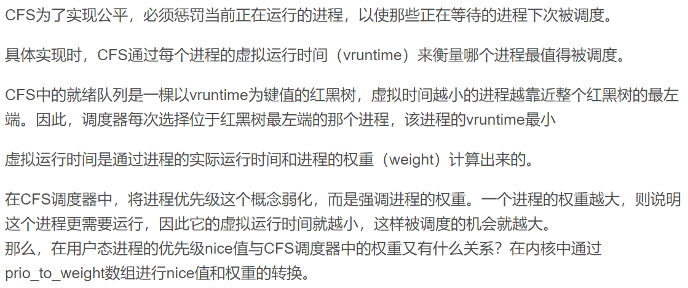
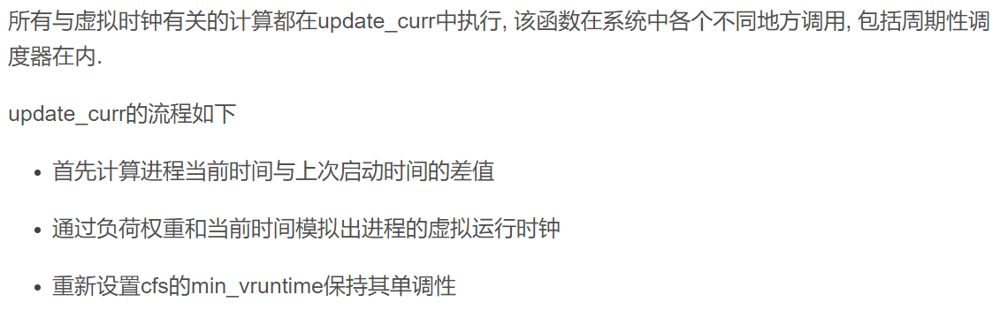
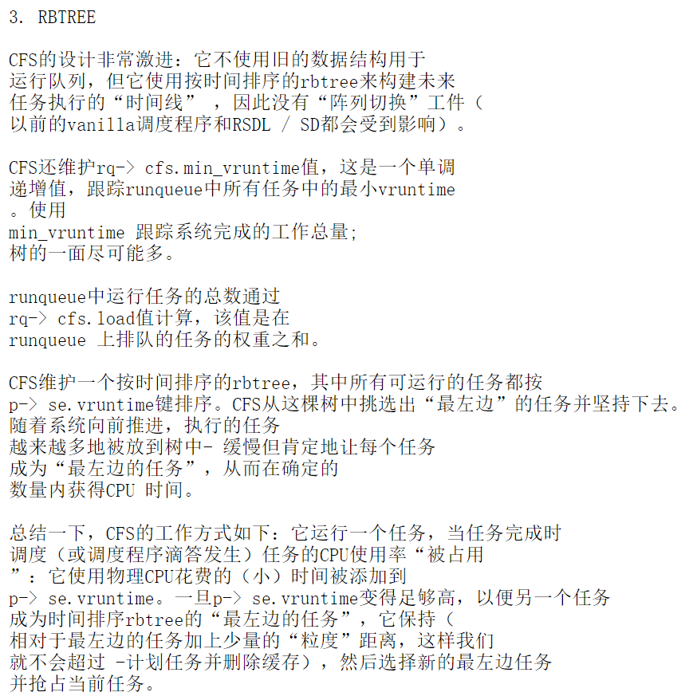
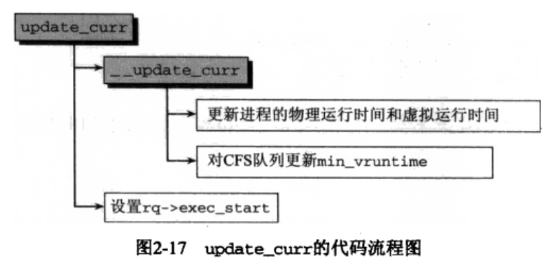
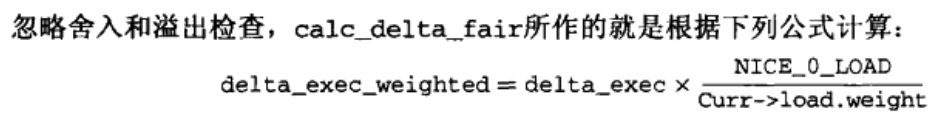
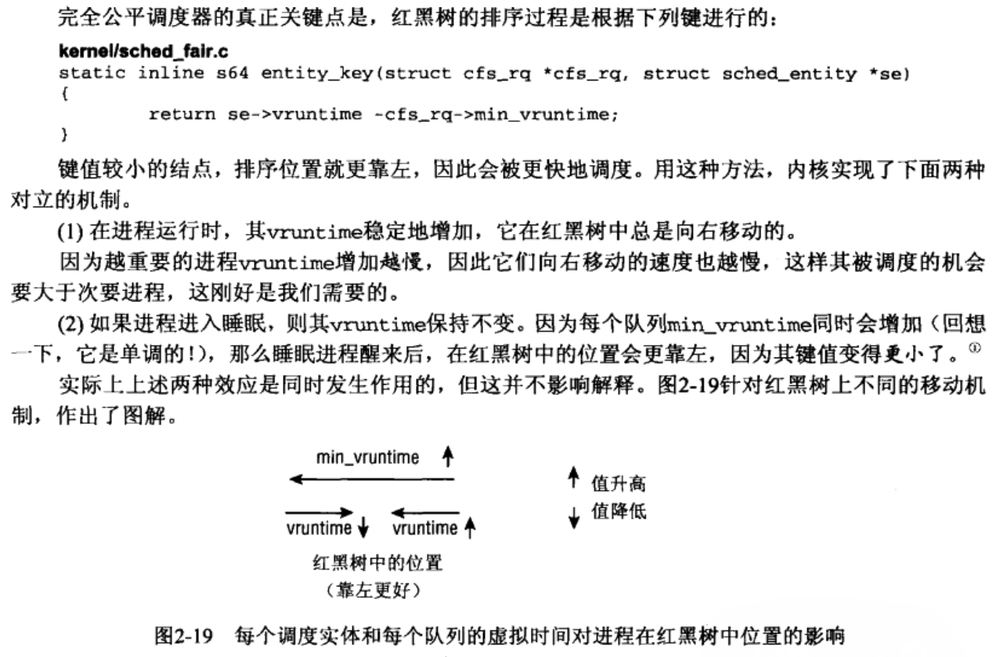

这两天心血来潮，打算读一波linux源码，不过当然有可能是三分钟热度，能读多少就看造化吧。

**Linux 内核版本v2.6.39.4**

第一篇文章，我也不打算按顺序写，到时候如果写多了再整理。

[task_struct](https://elixir.bootlin.com/linux/v2.6.39.4/source/include/linux/sched.h#L1193)，太多了，只把我觉得比较关键的地方标注了出来。

    struct task_struct 
    {
    	volatile long state;	/* -1 不可运行, 0 可运行, >0 停止 */
    	void *stack;
    	atomic_t usage;
    	unsigned int flags;	/* 每进程标志，下文定义 */
    	unsigned int ptrace;
    
    	int lock_depth;		/* 大内核锁深度 */
    
    #ifdef CONFIG_SMP
    #ifdef __ARCH_WANT_UNLOCKED_CTXSW
    	int oncpu;
    #endif
    #endif
    
    	int prio, static_prio, normal_prio;
    	unsigned int rt_priority;
    	const struct sched_class *sched_class;
    	struct sched_entity se;   /* 含有vruntime */
    	struct sched_rt_entity rt;
    
    #ifdef CONFIG_PREEMPT_NOTIFIERS
    	/* list of struct preempt_notifier: */
    	struct hlist_head preempt_notifiers;
    #endif
    
    	/*
    	 * fpu_counter contains the number of consecutive context switches
    	 * that the FPU is used. If this is over a threshold, the lazy fpu
    	 * saving becomes unlazy to save the trap. This is an unsigned char
    	 * so that after 256 times the counter wraps and the behavior turns
    	 * lazy again; this to deal with bursty apps that only use FPU for
    	 * a short time
    	 */
    	unsigned char fpu_counter;
    #ifdef CONFIG_BLK_DEV_IO_TRACE
    	unsigned int btrace_seq;
    #endif
    
    	unsigned int policy;
    	cpumask_t cpus_allowed;
    
    /* 进程状态 */
    	int exit_state;
    	int exit_code, exit_signal;
    	int pdeath_signal;  /*  在父进程终止时发送的信号  */
    	/* ??? */
    	unsigned int personality;
    	unsigned did_exec:1;
    	unsigned in_execve:1;	/* Tell the LSMs that the process is doing an
    				 * execve */
    	unsigned in_iowait:1;
    
    
    	/* Revert to default priority/policy when forking */
    	unsigned sched_reset_on_fork:1;
    
    	pid_t pid;
    	pid_t tgid;
    
    #ifdef CONFIG_CC_STACKPROTECTOR
    	/* Canary value for the -fstack-protector gcc feature */
    	unsigned long stack_canary;
    #endif
    
    	/* 
    	 * pointers to (original) parent process, youngest child, younger sibling,
    	 * older sibling, respectively.  (p->father can be replaced with 
    	 * p->real_parent->pid)
    	 */
    	struct task_struct *real_parent; /* 真正的父进程(调试下) */
    	struct task_struct *parent; /* 父进程 */
    	/*
    	 * children/sibling forms the list of my natural children
    	 */
    	struct list_head children;	/* 子进程链表 */
    	struct list_head sibling;	/* 连接到父进程的子进程链表 */
    	struct task_struct *group_leader;	/* 线程组组长 */
    
    	/*
    	 * ptraced is the list of tasks this task is using ptrace on.
    	 * This includes both natural children and PTRACE_ATTACH targets.
    	 * p->ptrace_entry is p's link on the p->parent->ptraced list.
    	 */
    	struct list_head ptraced;
    	struct list_head ptrace_entry;
    
    	/* PID/PID hash table linkage. */
    	struct pid_link pids[PIDTYPE_MAX];
    	struct list_head thread_group;
    
    	struct completion *vfork_done;		/* for vfork() */
    	int __user *set_child_tid;		/* CLONE_CHILD_SETTID */
    	int __user *clear_child_tid;		/* CLONE_CHILD_CLEARTID */
    
    	cputime_t utime, stime, utimescaled, stimescaled;
    	cputime_t gtime;
    #ifndef CONFIG_VIRT_CPU_ACCOUNTING
    	cputime_t prev_utime, prev_stime;
    #endif
    	unsigned long nvcsw, nivcsw; /* 上下文切换计数(context switch counts) */
    	struct timespec start_time; 		/* monotonic time */
    	struct timespec real_start_time;	/* boot based time */
    /* mm fault and swap info: this can arguably be seen as either mm-specific or thread-specific */
    	unsigned long min_flt, maj_flt;
    
    	struct task_cputime cputime_expires;
    	struct list_head cpu_timers[3];
    
    /* 进程身份凭据 */
    	const struct cred __rcu *real_cred; /* objective and real subjective task
    					 * credentials (COW) */
    	const struct cred __rcu *cred;	/* effective (overridable) subjective task
    					 * credentials (COW) */
    	struct cred *replacement_session_keyring; /* for KEYCTL_SESSION_TO_PARENT */
    
    	char comm[TASK_COMM_LEN]; /* executable name excluding path
    				     - access with [gs]et_task_comm (which lock
    				       it with task_lock())
    				     - initialized normally by setup_new_exec */
    /* 文件系统信息 */
    	int link_count, total_link_count;
    #ifdef CONFIG_SYSVIPC
    /* ipc stuff */
    	struct sysv_sem sysvsem;
    #endif
    #ifdef CONFIG_DETECT_HUNG_TASK
    /* hung task detection */
    	unsigned long last_switch_count;
    #endif
    /* 当前进程特定于CPU的状态信息 */
    	struct thread_struct thread;
    /* 文件系统信息 */
    	struct fs_struct *fs;
    /* open file information */
    	struct files_struct *files;
    /* 命名空间 */
    	struct nsproxy *nsproxy;
    /* 信号处理程序 */
    	struct signal_struct *signal;
    	struct sighand_struct *sighand;
    
    	sigset_t blocked, real_blocked;
    	sigset_t saved_sigmask;	/* restored if set_restore_sigmask() was used */
    	struct sigpending pending;
    
    	unsigned long sas_ss_sp;
    	size_t sas_ss_size;
    	int (*notifier)(void *priv);
    	void *notifier_data;
    	sigset_t *notifier_mask;
    	struct audit_context *audit_context;
    #ifdef CONFIG_AUDITSYSCALL
    	uid_t loginuid;
    	unsigned int sessionid;
    #endif
    	seccomp_t seccomp;
    
    /* 线程组跟踪 */
       	u32 parent_exec_id;
       	u32 self_exec_id;
    /* Protection of (de-)allocation: mm, files, fs, tty, keyrings, mems_allowed,
     * mempolicy */
    	spinlock_t alloc_lock;
    
    
    /* 日志文件系统信息 */
    	void *journal_info;
    
    /* stacked block device info */
    	struct bio_list *bio_list;
    
    /* 虚拟内存状态 */
    	struct reclaim_state *reclaim_state;
    
    	struct backing_dev_info *backing_dev_info;
    
    	struct io_context *io_context;
    
    	unsigned long ptrace_message;
    	siginfo_t *last_siginfo; /* For ptrace use.  */
    	struct task_io_accounting ioac;
    };

&nbsp;    
&nbsp;   
&nbsp;   
&nbsp;   

然后我想谈的就是CFS了。。。(完全公平的调度程序)  
## Completely Fair Scheduling
**一些参考：借鉴了很多**

- [Completely Fair Scheduler - wiki](https://en.wikipedia.org/wiki/Completely_Fair_Scheduler#OS_background)
- [What is the concept of vruntime in CFS - Stack Overflow](https://stackoverflow.com/questions/19181834/what-is-the-concept-of-vruntime-in-cfs)
- [CFS Scheduler](https://www.kernel.org/doc/Documentation/scheduler/sched-design-CFS.txt)
- [Linux CFS调度器之虚拟时钟vruntime与调度延迟--Linux进程的管理与调度(二十六）](https://blog.csdn.net/gatieme/article/details/52067748)

&nbsp;   
CFS使用一种名为 “sleeper fairness” 的概念，该概念考虑睡眠或等待任务等同于 运行队列 上的任务。这意味着大部分时间等待用户输入或其他事件的交互式任务在需要时可以获得相当的CPU时间份额。
&nbsp;   
`task_struct` 中含有 `sched_entity` 的实体 `se` 。  
用于调度算法的数据结构是红黑树，其中节点是特定于调度程序的sched_entity结构。  
[sched_entity](https://elixir.bootlin.com/linux/v2.6.39.4/source/include/linux/sched.h#L1142)

    struct sched_entity {
    	struct load_weight	load;		/* for load-balancing */
    	struct rb_node		run_node;
    	struct list_head	group_node;
    	unsigned int		on_rq;      /* 是否在就绪队列上 */
    
    	u64			exec_start;         /* 上次启动时间 */
    	u64			sum_exec_runtime;   /* 真实CPU消耗时间 */
    	u64			vruntime;           /* 虚拟运行时间 */
    	u64			prev_sum_exec_runtime; /* 进程撤销时，将sum_exec_runtime保存到这个值 */
    
    	u64			nr_migrations;
    
    #ifdef CONFIG_SCHEDSTATS
    	struct sched_statistics statistics;
    #endif
    
    #ifdef CONFIG_FAIR_GROUP_SCHED
    	struct sched_entity	*parent;
    	/* rq on which this entity is (to be) queued: */
    	struct cfs_rq		*cfs_rq;
    	/* rq "owned" by this entity/group: */
    	struct cfs_rq		*my_q;
    #endif
    };

CFS调度算法的思想：理想状态下每个进程都能获得相同的时间片，并且同时运行在CPU上，但实际上一个CPU同一时刻运行的进程只能有一个。也就是说，当一个进程占用CPU时，其他进程就必须等待。CFS为了实现公平，必须惩罚当前正在运行的进程，以使那些正在等待的进程下次被调度。

虚拟时钟可以根据现存的实际时钟和每个进程相关的负荷权重推算出来。  
权重越高，说明进程的优先级比较高，进而该进程虚拟时钟增长的就慢。  
`vruntime` 通过调用 `update_curr` 更新。

&nbsp;   
&nbsp;   
当调度程序被调用来运行一个新的进程时，调度程序的操作如下：

1. 调度树的最左边的节点被选中（因为它具有最低的花费执行时间），并被发送用于执行。  
2. 如果进程完成执行，它将从系统和调度树中删除。  
3. 如果进程达到最大执行时间或以其他方式停止（自动或通过中断），则基于其新的执行时间将其重新插入调度树。  
4. 然后从树中选择新的最左边的节点，重复迭代。  

-----

2018-05-17 更新   
(注：假设读者已经通晓红黑树，参考[红黑树总结](https://blog.csdn.net/rsy56640/article/details/79874914))   
**CFS 调度**（参考《深入Linux内核架构》）   
[sched_class](https://elixir.bootlin.com/linux/v2.6.39.4/source/kernel/sched_fair.c#L4237)   
[cfs_rq](https://elixir.bootlin.com/linux/v2.6.39.4/source/kernel/sched.c#L309)   

    /* CFS-related fields in a runqueue */
    struct cfs_rq {
    	struct load_weight load;
    	unsigned long nr_running;
    
    	u64 exec_clock;
    	u64 min_vruntime;
    
    	struct rb_root tasks_timeline;
    	struct rb_node *rb_leftmost;
    
    	struct list_head tasks;
    	struct list_head *balance_iterator;
    
    	/*
    	 * 'curr' points to currently running entity on this cfs_rq.
    	 * It is set to NULL otherwise (i.e when none are currently running).
    	 */
    	struct sched_entity *curr, *next, *last, *skip;
    
    	unsigned int nr_spread_over;
    
    #ifdef CONFIG_FAIR_GROUP_SCHED
    	struct rq *rq;	/* cpu runqueue to which this cfs_rq is attached */
    
    	/*
    	 * leaf cfs_rqs are those that hold tasks (lowest schedulable entity in
    	 * a hierarchy). Non-leaf lrqs hold other higher schedulable entities
    	 * (like users, containers etc.)
    	 *
    	 * leaf_cfs_rq_list ties together list of leaf cfs_rq's in a cpu. This
    	 * list is used during load balance.
    	 */
    	int on_list;
    	struct list_head leaf_cfs_rq_list;
    	struct task_group *tg;	/* group that "owns" this runqueue */
    
    #ifdef CONFIG_SMP
    	/*
    	 * the part of load.weight contributed by tasks
    	 */
    	unsigned long task_weight;
    
    	/*
    	 *   h_load = weight * f(tg)
    	 *
    	 * Where f(tg) is the recursive weight fraction assigned to
    	 * this group.
    	 */
    	unsigned long h_load;
    
    	/*
    	 * Maintaining per-cpu shares distribution for group scheduling
    	 *
    	 * load_stamp is the last time we updated the load average
    	 * load_last is the last time we updated the load average and saw load
    	 * load_unacc_exec_time is currently unaccounted execution time
    	 */
    	u64 load_avg;
    	u64 load_period;
    	u64 load_stamp, load_last, load_unacc_exec_time;
    
    	unsigned long load_contribution;
    #endif
    #endif
    };

&nbsp;   
CFS调度完全依赖于虚拟时钟，即通过负荷权重和实际运行权重推导出来的一个值。
相关计算于`update_curr`中执行   
[update_curr](https://elixir.bootlin.com/linux/v2.6.39.4/source/kernel/sched_fair.c#L573),  [__update_curr](https://elixir.bootlin.com/linux/v2.6.39.4/source/kernel/sched_fair.c#L553)  

    static inline struct rq *rq_of(struct cfs_rq *cfs_rq)
    {
    	return cfs_rq->rq;
    }
    
    static void update_curr(struct cfs_rq *cfs_rq)
    {
    	struct sched_entity *curr = cfs_rq->curr;
    	u64 now = rq_of(cfs_rq)->clock_task; //clock_task定义于sched.c struct rq中494行，具体啥意思我也不懂。。。 
    	unsigned long delta_exec;
    
    	if (unlikely(!curr))	//就绪队列为空 
    		return;				//返回 
    
    	/*
    	 * Get the amount of time the current task was running
    	 * since the last time we changed load (this cannot
    	 * overflow on 32 bits):
    	 */
    	delta_exec = (unsigned long)(now - curr->exec_start);   //计算clock_task与当前进程启动时间差 
    	if (!delta_exec)
    		return;
    
    	__update_curr(cfs_rq, curr, delta_exec);				//并将其余工作委托给__update_curr 
    	curr->exec_start = now;
    
    	if (entity_is_task(curr)) {
    		struct task_struct *curtask = task_of(curr);
    
    		trace_sched_stat_runtime(curtask, delta_exec, curr->vruntime);
    		cpuacct_charge(curtask, delta_exec);
    		account_group_exec_runtime(curtask, delta_exec);
    	}
    }

关于虚拟时钟的计算，通过物理时间和负荷权重得出，而负荷权重与进程优先级有关。运算过程委托给 `__update_curr` 函数。   
注：越重要的进程会有越高的优先级(即 越低的`nice`值，)，会得到更大的权重，因此累加的虚拟运行时间会小一些。   

    /*
     * Update the current task's runtime statistics. Skip current tasks that
     * are not in our scheduling class.
     */
    static inline void
    __update_curr(struct cfs_rq *cfs_rq, struct sched_entity *curr,
    	      unsigned long delta_exec)
    {
    	unsigned long delta_exec_weighted;
    
    	schedstat_set(curr->statistics.exec_max,
    		      max((u64)delta_exec, curr->statistics.exec_max));
    
    	curr->sum_exec_runtime += delta_exec;
    	schedstat_add(cfs_rq, exec_clock, delta_exec);
    	delta_exec_weighted = calc_delta_fair(delta_exec, curr);
    
    	curr->vruntime += delta_exec_weighted;
    	update_min_vruntime(cfs_rq);
    
    #if defined CONFIG_SMP && defined CONFIG_FAIR_GROUP_SCHED
    	cfs_rq->load_unacc_exec_time += delta_exec;
    #endif
    }
    
    /* 定义于sched_fair.c  477-484行
     * delta /= w
     */
    static inline unsigned long
    calc_delta_fair(unsigned long delta, struct sched_entity *se)
    {
    	if (unlikely(se->load.weight != NICE_0_LOAD))
    		delta = calc_delta_mine(delta, NICE_0_LOAD, &se->load);
    
    	return delta;
    }
    
    /* 定义于sched_fair.c  1304-1329行 
     * delta *= weight / lw
     * 运算过程代码中很清楚，就不写了。
     */
    static unsigned long
    calc_delta_mine(unsigned long delta_exec, unsigned long weight,
    		struct load_weight *lw)
    {
    	u64 tmp;
    
    	if (!lw->inv_weight) {
    		if (BITS_PER_LONG > 32 && unlikely(lw->weight >= WMULT_CONST))
    			lw->inv_weight = 1;
    		else
    			lw->inv_weight = 1 + (WMULT_CONST-lw->weight/2)
    				/ (lw->weight+1);
    	}
    
    	tmp = (u64)delta_exec * weight;
    	/*
    	 * Check whether we'd overflow the 64-bit multiplication:
    	 */
    	if (unlikely(tmp > WMULT_CONST))
    		tmp = SRR(SRR(tmp, WMULT_SHIFT/2) * lw->inv_weight,
    			WMULT_SHIFT/2);
    	else
    		tmp = SRR(tmp * lw->inv_weight, WMULT_SHIFT);
    
    	return (unsigned long)min(tmp, (u64)(unsigned long)LONG_MAX);
    }
    
    //定义于sched_fair.c  342-361行
    static void update_min_vruntime(struct cfs_rq *cfs_rq)
    {
    	u64 vruntime = cfs_rq->min_vruntime;
    
    	if (cfs_rq->curr)
    		vruntime = cfs_rq->curr->vruntime;
    
    	if (cfs_rq->rb_leftmost) {
    		struct sched_entity *se = rb_entry(cfs_rq->rb_leftmost,
    						   struct sched_entity,
    						   run_node);
    
    		if (!cfs_rq->curr)
    			vruntime = se->vruntime;
    		else
    			vruntime = min_vruntime(vruntime, se->vruntime);
    	}
    
    	cfs_rq->min_vruntime = max_vruntime(cfs_rq->min_vruntime, vruntime); //保证递增
    }

上文最后一个函数 `update_min_vruntime`，做了一些操作，以**保证 `min_vruntime` 是单调递增的**。   
(下面和书上有些出入，原文为 `first_fair` 函数，原因是书中内核版本为v2.6.24)
检测RB树上最左端结点，即检测是否有进程在树上等待调度。再和当前运行实体(`running entity`) 取最小值。最后，取max保证 `min_vruntime` 递增。   
