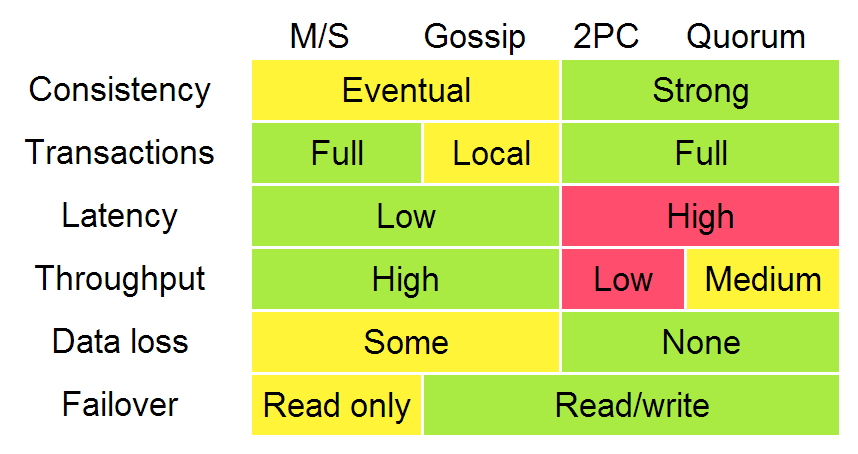

# [Distributed systems for fun and profit](http://book.mixu.net/distsys/index.html) 阅读笔记

躺在收藏夹几年了，最近大概要做点分布式的东西，，拿出来看一看。   
**这里面有很多 Further reading，之后还得好好研究。**

- [1. Distributed systems at a high level](#1)
- [2. Up and down the level of abstraction](#2)
- [3. Time and order](#3)
- [4. Replication](#4)
- 

可参考笔记：

- [随笔分类 - 分布式系统](https://www.cnblogs.com/lichen782/category/999910.html)

&nbsp;   

## [1. Distributed systems at a high level](http://book.mixu.net/distsys/intro.html)

- Scalability：当task的规模不断上涨时可以 1. 增加node；2. 增加异地数据中心（处理延迟）
- Performance
  - 低延迟：受限于物理层面
  - 高吞吐
  - 低消耗
- Latency：
- Availability：技术上主要考虑 fault-tolerance

### Abstractions and Models

- System Model (asynchronous / synchronous)
- Failure Model (crash-fail, partitions, Byzantine)
- Consistency Model (strong / eventual)

### Partition and Replicate

- Partition: 将数据集分割成独立的子集
  - performance: 限制处理数据大小，同一分区内数据相关
  - availability: 分区允许fail，降低了对整体可用性造成影响的概率
  - *Partitioning is mostly about defining your partitions based on what you think the primary access pattern will be, and dealing with the limitations that come from having independent partitions*
- Replicate: 同样的数据复制到多台机器上
  - performance: 额外的计算能力和带宽
  - availability: 某些结点fail了也没事
  - *Replication is about providing extra bandwidth, and caching where it counts. It is also about maintaining consistency in some way according to some consistency model*
  - 要维护 **consistency**，**trade-off**

&nbsp;   

##[2. Up and down the level of abstraction](http://book.mixu.net/distsys/abstractions.html)

### 关于系统模型的若干假设

#### Nodes
- 功能：1. 执行程序；2. 存储数据到mem和disk；3. （并不准确的）时钟
- 一个node 在接受 msg 和接受msg时的 state 决定了：本地 computation，完成后的 state，以及发送的 msg
- 通常认为 node 只有在 crash 才 fail，并且之后的某个时间点会 recover
- 另一种假设是 node 可能 misbehave，也就是拜占庭将军问题，这里不讨论

#### Communication Links
- 通常认为是 unreliable, msg 可能 lost 或 delayed
- 很多情况很具体，视情况做优化和trade-off

#### Time and Order
同步模型：假定 msg delay 有上界，并且 clock 保证同步   
异步模型：node 只有 crash 才 fail，msg 可以无限期 delay

consensus：
1. Agreement
2. Integrity
3. Termination
4. Validity

#### FLP
即使最多一个 node fail，也没有算法保证在异步模型中的 consensus

#### CAP
- **Consistency**: 同一时刻，所有 nodes 看到的数据是一致的（即强一致性）
- **Availability**: 某些 node fail 不影响其他 nodes 继续运行（即服务始终可用）
- **Partition tolerance**: *网络分区* 不影响整个系统继续运行（即协议可以容忍任何网络分区异常）

最多只能同时满足两点

`CA` 和 `CP` 都提供了 strong consistency，区别在于：`CA` 不允许 node fail；`CP` 有 `2f+1` 个 node，那么允许 `f` 个 node fail

- `CA` 不区分 node fail 还是 network fail，所以 stop accepting writes，防止 multiple copies
- `CP` 在两个分区上采取强制非对称的行为来保证 single-copy consistency
- `CA` 没有分区，常用2PC，多用于分布式关系数据库；`CP` 有分区，用 Paxos/Raft 等区分，并且允许网络故障

在强一致性和性能之间做trade-off，提高可用性

### Consistency Model

- Strong Consistency Model
  - Linearizable Consistency：顺序可以对外公布
  - Sequential Consistency：每个 node 看到的顺序一致
- Weak Consistency Model
  - Client-Centric Consistency Model：保证用户不会访问old data（实现上通常在本地保留快照缓存）
  - Causal Consistency: Strongest Model Available
  - Eventual Consistency Model

&nbsp;   

##[3. Time and order](http://book.mixu.net/distsys/time.html)

- 偏序（partial order）而非全序（total orer）
- timestamp 可以强加一个 order

#### global clock
- 假定所有 nodes 上的 clock 都是 sync
- 注意 clock drift
- Google/Spanner TrueTime API

#### local clock
- each machine has its own clock
- partial order

#### no clock
- vector clocks

### Vector Clocks

#### Lamport clock
- 每个进程有 timestamp，每次 +1
- 只能表示单一时间线，不同历史会冲突，比较不同分支的 timestamp 没有任何意义

#### Vector clock
- 每个进程有 一组timestamp，表示所有的 node

### Failure detectors (time for cutoff)

常用 **heartbeat message** 和 timeout 实现，failure detectors 有两条准则：

- Completeness
  - Strong：任何 crashed进程 eventually 被 correct进程 suspect
  - Weak：任何 crashed进程 eventually 被 some correct进程 suspect
- Accuracy
  - Strong：没有错查的
  - Weak：有错查（correct进程 被 suspect）

Completeness 相对容易， weak 可以 广播 suspected进程 从而变为 strong；因此我们主要关注 Accuracy（困难在于 message delay）   
如果系统想要 strong consistency，那么 failure detect 就非常重要了。因为 crashed nodes 可以被忽略，而 partition 不行。

### Time, Order and Performance

实现 total order 的简单方法是：选一个 leader，所有的任务都要经过这个 leader

&nbsp;   

##[4. Replication](http://book.mixu.net/distsys/replication.html)

- 做 replication 和 response 的时机 —— durability / consistency
- 对 divergence 的容忍程度

维护 single-copy consistence 的算法：

- 1n messages (asynchronous primary/backup)
- 2n messages (synchronous primary/backup)
- 4n messages (2-phase commit, Multi-Paxos)
- 6n messages (3-phase commit, Paxos with repeated leader election)

### 主从复制 P/B
- 所有 update 在 primary 上做，log 通过网络传给 backup
- 同步：需要等待 backup 回复；并且也有可能不一致（backup 回复 ACK时，primary fail）
- 异步：weak durability guarantees

### 两阶段提交 2PC
- 第一阶段（voting）：*协调者* 给所有 *参与者* 发送update，*参与者* 投票决定是否 commit（如果决定 commit，结果放在 WAL）
- 第二阶段（decision）：*协调者* 决定结果并通知 *参与者*，*参与者* 根据决定做 update
- 允许 rollback
- 属于CA，对 network partition 没有容错

### 对网络分割的容错的一致性算法
- 难以区分 network partition 和 node failure
- 多数决策（major decision）

在 Paxos 和 Raft 中，每一轮（epoch）是两次选举的间隔（包含 election 和之后的 normal operation）

> 这块的内容，目前对于 value 和 number of proposal 还不是很了解

### 强一致性的 replication 算法

- 主从
  - 单一、静态 master
  - slaves 值拷贝 log，不参与具体操作
  - replication delay 无限制
  - 对 network partition 无容错
  - 人工恢复错误
- 2PC
  - 全票通过：commt 或 abort
  - 静态 master
  - coordinator 和 node 同时 fail，就挂了
  - 对 network partition 无容错
- Paxos
  - 多数投票
  - 动态 master
  - 只要一半以上没fail就正常
  - latency

&nbsp;   

##

